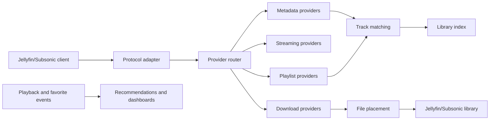

# Allstarr Platform Overhaul

This file is the implementation charter for the overhaul. Start here, then follow the owned specifications in [docs/steering/references](docs/steering/references/README.md).

Allstarr is a self-hosted music platform gateway: a client-compatible front door for Jellyfin and Subsonic clients, backed by pluggable providers for metadata, streaming, downloads, playlists, lyrics, scrobbling, enrichment, recommendations, health, and automation.

The overhaul kept ASP.NET Core as the control plane, added Postgres for durable state, retained Valkey for cache and acceleration, and introduced a typed capability core beside compatibility services. Optional external provider services remain separate deployments.

## Plan Status And Ownership

The version 3 beta implementation and all eight overhaul phases are complete. This file preserves the locked decisions, implemented design, completion evidence, and original phase roadmap. Current-state sections are authoritative. The roadmap near the end is historical and is not an unfinished task list.

This root file owns:

- product outcomes, non-negotiable constraints, architecture decisions, migration order, and phase exit criteria;
- decisions that affect more than one reference area; and
- the source-of-truth priority when a roadmap decision conflicts with an implementation detail.

The linked reference files own the detailed specifications for their areas. Update the root decision and the affected owned specification together; do not duplicate a full specification in both places.

### Locked Direction

- Preserve proxy compatibility while migrating; introduce adapters around current services before replacing internals.
- Treat original libraries as read-only inputs. Allstarr may manage only files it explicitly owns.
- Keep audio and other managed media in operator-accessible library folders or volumes. Postgres and SQLite store metadata, references, checksums, and workflow state, never song payloads or media blobs.
- Use one selected proxy protocol surface per deployment until a separately designed multi-surface host exists. The current host cannot register Jellyfin and Subsonic catch-all controllers together.
- Make account scope, identity resolution, secret storage, durable jobs, and observability foundations the prerequisites for multi-user capability routing. WebUI polish comes after those foundations.
- Select Postgres or SQLite at startup. Never silently fall back from a running Postgres deployment to SQLite.
- Ship the overhaul as a breaking fresh-install release for pre-overhaul deployments. Do not carry forward the Redis-to-Valkey conversion overlay or promise an in-place migration from legacy runtime state. Offer an explicit WebUI preview/confirm wizard for allowlisted `.env` settings and encrypted shared accounts after the fresh database is ready. Future upgrades from the new durable baseline still require normal migrations, backups, and rollback procedures.
- Treat third-party extensions as untrusted until their package, declared permissions, and runtime boundary have been verified.

### Open Decisions That Require An Explicit Change

- Whether a future deployment may serve Jellyfin and Subsonic protocol surfaces simultaneously, and what ports, routing, and authentication that requires.
- A future stronger extension isolation boundary beyond the current trusted, constrained in-process Jint runtime.
- The precise identity-provider and account-recovery experience for deployments without Jellyfin-backed administration.
- Any automatic provider behavior that could incur provider charges, rate-limit pressure, or rights-sensitive media actions.

## How To Use This Plan

1. Read this file first and identify the relevant current-state section. Use the completed phase records only for
   design history and earlier exit evidence.
2. Read the current-code steering docs that match the change area, especially [docs/steering/INTRODUCTION.md](docs/steering/INTRODUCTION.md), [docs/steering/ARCHITECTURE.md](docs/steering/ARCHITECTURE.md), [docs/steering/PROVIDERS.md](docs/steering/PROVIDERS.md), [docs/steering/DOWNLOADS.md](docs/steering/DOWNLOADS.md), [docs/steering/BACKENDS.md](docs/steering/BACKENDS.md), [docs/steering/CACHING.md](docs/steering/CACHING.md), [docs/steering/SCROBBLING.md](docs/steering/SCROBBLING.md), and [docs/steering/TESTING.md](docs/steering/TESTING.md).
3. Use the owned specifications in [docs/steering/references/README.md](docs/steering/references/README.md), and update the relevant specification when changing behavior.
4. Preserve existing user changes. Do not reset unrelated work.
5. Run `dotnet test allstarr.sln` before declaring implementation complete unless the change is docs-only or the environment is blocked.

## Product Goal

Allstarr should free users from one-provider music lock-in while keeping client compatibility. A user should be able to:

- Use Jellyfin- and Subsonic-compatible clients with the selected backend/protocol deployment, including Jellyfin or a compatible server such as Navidrome.
- Stream through the fastest policy-eligible provider available.
- Download through the highest-quality policy-eligible provider available.
- Pull playlists, favorites, library songs, and metadata from different providers.
- Match external tracks against the local library with explainable confidence.
- Link one canonical recording to every verified provider identity and local-library copy that represents it, then use only the providers selected and authorized for the requested stream or download.
- Import provider playlists as virtual views or explicitly materialize them into Jellyfin or a Subsonic-compatible backend such as Navidrome, either on demand or on a durable schedule.
- Favorite a song and optionally trigger download, tagging, placement, and backend refresh.
- Enrich kept music with MusicBrainz, beets, Picard-compatible naming, provider artwork, lyrics, and listening history.
- Run a lightweight setup, the first-party package bundle, or selected external provider services independently.
- Let administrators manage the platform while users manage their own accounts when configured that way.
- Extend the system through provider extensions in SDK v1 and separately permissioned automation extensions in a later SDK version.

## System Roles And Topology

Use these terms consistently. A protocol is not an identity provider, and a client is not necessarily the backend that owns the local library.

| Role | Responsibility | Overhaul boundary |
| --- | --- | --- |
| Client | A Jellyfin- or Subsonic-compatible app used by a person. | Speaks only the selected protocol surface. |
| Protocol adapter | Translates a protocol request and response into core requests. | Owns protocol shaping, compatibility errors, and client fixtures; it does not own provider HTTP details. |
| Backend | Jellyfin or a Subsonic-compatible server such as Navidrome that owns an existing local library. | Remains the authority for its own library and client-auth behavior until an explicit identity bridge says otherwise. |
| Allstarr core | Capability routing, durable state, jobs, matching, and policy. | Does not impersonate a backend or mutate source-library files. |
| Managed library | Files written and tracked by Allstarr. | May be tagged, placed, refreshed, or explicitly removed through managed-file actions. |
| Provider account | A global, user, or library-scoped credentialed connection. | Is selected only through an authenticated execution context and policy. |

The current deployment model exposes exactly one proxy protocol surface: Jellyfin or Subsonic. A future multi-surface host is a separate architecture decision, not an incidental controller registration change.

### Identity And Account Resolution

Before `ProviderRouter` handles user-scoped work, `BackendIdentityResolver` and `ProviderAccountResolver` establish the authorized identity and account scope.

- `BackendIdentityResolver` maps the authenticated backend principal and request context to a stable Allstarr user identity without changing transparent proxy authentication behavior.
- `ProviderAccountResolver` returns only accounts the user and policy may use, with an auditable reason for each selection.
- Account scope is explicit: global accounts are admin-owned, user accounts are tenant-owned, and library accounts are limited to their configured library roots.
- A forced shared downloader is a policy decision; it must not silently override a user account for playlist, scrobbling, or personal-library actions.
- Every durable user-facing record, cache key, job, event, playlist link, and secret reference is tenant-scoped unless it is deliberately platform-global.

## Non-Negotiable Principles

- Streaming and downloading are separate lanes.
- Metadata can come from many sources and should be mergeable.
- Provider capability should be explicit: metadata, streaming, download, playlist, lyrics, scrobbling, enrichment, recommendation, automation, and UI.
- Optional sidecars must degrade capability instead of breaking startup.
- Original user libraries are add-only. Allstarr must not delete or rewrite source library files without an explicit managed-file action.
- Durable databases hold control-plane state only. They must not contain encoded song bytes; playable files stay in configured, accessible media roots.
- `.env` should hold deployment settings and initial secrets, not runtime state. The UI must not expose raw API keys or send secrets to third-party services.
- Built-in providers should use the same internal contracts as extensions.
- Do not auto-add the SpotiFLAC registry. Let users add that registry explicitly.
- No live provider tests in the automated suite. Use fake providers, local fixtures, mocked HTTP, and sidecar contract tests.
- Every behavior change, bug fix, contract change, and migration rule must add or update focused tests and fixtures before it is considered complete.
- Code should be readable and debuggable by a normal programmer. Prefer clear modules, explicit control flow and failure paths, useful names, small focused functions, and short simple comments that explain intent rather than restate code.

## Confirmed Defaults

These defaults are confirmed product decisions:

- Multi-user mode defaults to `Hybrid`.
- Users can connect their own provider accounts.
- Admins can also configure global/shared provider accounts, including one shared downloader account for multiple users.
- Favoriting in Jellyfin keeps normal Jellyfin favorite behavior.
- Favorite-triggered download, tagging, placement, backend refresh, and external playlist changes are opt-in.
- Favorite auto-download is off by default.
- Original library deletion is never allowed by default.
- Extension SDK v1 is provider-only: metadata, streaming, download, playlist, lyrics, and health.
- The SDK design must leave room for later automation, enrichment, recommendations, and UI extensions.
- Standard Docker Compose is the recommended default: core app, Postgres, and Valkey.
- AIO Compose remains available for the verified first-party package bundle; provider sidecars stay separate opt-ins.
- Standard and AIO do not start Apple services. The separate Apple overlay builds the repository gateway with
  GAMDL 3.8.2 and the source-locked official wrapper-v2 0.0.2 checkout after the operator supplies verified legal
  Apple libraries. Removing the overlay degrades only Apple capabilities and preserves its session volume.
- Low-resource alternatives must be supported. Removing optional services should reduce capability, not break the app.
- Apple is split into `apple-download` and `apple-musickit`.
- Extension registry trust starts with checksum verification. Add signatures later.
- No third-party extension registry is added automatically.
- SpotiFLAC's extension model is a reference to test against, not the Allstarr default registry.
- Playlist imports default to a non-destructive reconcile. Recreate-on-every-run is an explicit per-link option, and neither mode may remove or rewrite audio files.
- Pre-overhaul installs start again with the new deployment layout and configuration. The overhaul does not retain a Redis-to-Valkey upgrade-only compose file.

## Implemented Foundation

These requirements are implemented and remain architectural constraints for cross-provider routing and user-scoped automation:

- A durable secret-reference model. Settings tables store references and metadata, never plaintext provider credentials.
- An encrypted secret store with key-management, rotation, revocation, backup, and redacted diagnostic rules.
- A database-backed job/outbox model with idempotency keys, attempts, leases, retry/backoff, cancellation, and operator-visible failure state.
- Fresh-install bootstrap, schema migration, backup, restore, and rollback procedures for the new durable baseline. Legacy `.env`, cache, mapping, extension, and job state are not imported automatically from pre-overhaul installs.
- Structured redacted logs, metrics, traces, and route-decision records that identify the provider account and capability without exposing credentials or media URLs.
- Provider policy that honors account scope, allowed quality, user preference, rate limits, storage capacity, provider terms, and explicit opt-in for active probes or downloads.

## Secrets And Test Credentials

Do not commit real or temporary API keys to markdown, source, tests, or fixtures. This plan documents only the secret types and expected storage flow.

Real values belong only in a protected bootstrap source such as `.env` with restrictive permissions, Docker secrets, the encrypted runtime secret store, or a manual live-test environment. The WebUI masks secrets and does not send them to third-party services except the provider they belong to.

Likely credentials for manual/live validation:

- Apple MusicKit: Apple Developer Team ID, Key ID, private key, generated developer token, and per-user Music User Token.
- Apple download gateway: Apple ID login through the compatible external gateway/UI flow, including 2FA when required.
- Last.fm: API key and API secret, followed by per-user session key from the auth flow.
- ListenBrainz: per-user token.
- Spotify: future OAuth client ID and secret, or current session/cookie flow while migrating.
- Qobuz and Deezer: user auth/session data for manual testing only.
- MusicBrainz: no API key, but Allstarr must use a meaningful User-Agent/contact string.
- AudioMuse-AI: sidecar URL and optional auth if the deployment enables it.

## Current Code Facts

| Area | Current source | What it means |
| --- | --- | --- |
| Host shape | [docs/steering/ARCHITECTURE.md](docs/steering/ARCHITECTURE.md), `allstarr/Program.cs` | Allstarr is already a two-surface ASP.NET Core host: proxy and admin UI. Preserve that boundary. |
| Provider docs | [docs/steering/PROVIDERS.md](docs/steering/PROVIDERS.md) | Typed capability contracts and `ProviderRouter` are authoritative. Legacy metadata services remain compatibility adapters. |
| Downloads | [docs/steering/DOWNLOADS.md](docs/steering/DOWNLOADS.md) | Streaming and downloading are separate provider-neutral capability lanes with durable managed-artifact ownership. |
| Current extensions | [allstarr/Services/Common/ExtensionManager.cs](allstarr/Services/Common/ExtensionManager.cs) | SDK v1 verifies checksums, manifests, permissions, archive bounds, staged activation, disable/update, and rollback. JavaScript packages run as trusted code in constrained in-process Jint, not an operating-system sandbox. |
| Metadata routing | [allstarr/Core/Routing](allstarr/Core/Routing), [allstarr/Services/Common/MultiProviderMetadataService.cs](allstarr/Services/Common/MultiProviderMetadataService.cs) | `ProviderRouter` owns typed routing. `MultiProviderMetadataService` remains a compatibility convergence point. |
| Download routing | [allstarr/Services/Common/MultiProviderDownloadService.cs](allstarr/Services/Common/MultiProviderDownloadService.cs) | Typed streaming and download routes are separate. This service remains only where compatibility paths still use it. |
| Provider health | [allstarr/Core/Health/DurableProviderHealthStore.cs](allstarr/Core/Health/DurableProviderHealthStore.cs), [allstarr/Services/Common/ProviderStatusManager.cs](allstarr/Services/Common/ProviderStatusManager.cs) | Durable provider-account/capability samples, 15-minute rollups, retention, and circuit state are authoritative for typed routes. `ProviderStatusManager` remains an in-memory compatibility projection. |
| Durable storage | [allstarr/Core/Storage](allstarr/Core/Storage), [storage runbook](docs/operations/storage.md) | Startup selects Postgres or SQLite explicitly, applies provider-neutral EF migrations under a database-specific lock, and never falls back to another database. Verified backup, restore, and state-transfer operations are available through the admin surface and offline `storage` command. |
| Identity and accounts | [allstarr/Core/Identity](allstarr/Core/Identity), [allstarr/Controllers/ProviderAccountsController.cs](allstarr/Controllers/ProviderAccountsController.cs) | Backend principals resolve to tenant-scoped platform users. Global, user, and library provider accounts are stored durably and filtered by account policy. |
| Secrets | [allstarr/Core/Secrets](allstarr/Core/Secrets) | Provider-account records hold secret references. Versioned secret values are protected with AES-GCM using an external key ring, with replace, rotate, revoke, and tenant access rules. |
| Durable work | [allstarr/Core/Jobs](allstarr/Core/Jobs), [allstarr/Controllers/JobsController.cs](allstarr/Controllers/JobsController.cs) | Jobs, attempts, leases, idempotency keys, cancellation, retry state, sidecar deferrals, and transactional outbox messages live in the selected database. Users can inspect and cancel only their own jobs; admins can inspect all jobs. |
| Operations | [allstarr/Core/Operations](allstarr/Core/Operations), [allstarr/Controllers/DiagnosticsController.cs](allstarr/Controllers/DiagnosticsController.cs) | Liveness, readiness, sidecar capability state, redacted structured logs, correlated diagnostics, and Prometheus-style metrics expose the durable foundation without leaking credentials, media URLs, or account names. |
| Apple download gateway | [AppleMusicController.cs](allstarr/Controllers/AppleMusicController.cs), [Apple Music services](allstarr/Services/AppleMusic), [gateway](sidecars/apple-gateway) | The optional profile calls the repository gateway, which runs pinned GAMDL against a locked official wrapper-v2 build. The gateway contract, health probe, and runtime manifest decide which capabilities can be advertised. |
| Jellyfin protocol | [allstarr/Controllers/JellyfinController.Audio.cs](allstarr/Controllers/JellyfinController.Audio.cs), [allstarr/Controllers/JellyfinController.Search.cs](allstarr/Controllers/JellyfinController.Search.cs), [allstarr/Controllers/JellyfinController.PlaylistHandler.cs](allstarr/Controllers/JellyfinController.PlaylistHandler.cs) | Jellyfin compatibility stays the first protocol adapter. |
| Spotify playlists | [allstarr/Controllers/JellyfinController.Spotify.cs](allstarr/Controllers/JellyfinController.Spotify.cs), [docs/steering/SPOTIFY.md](docs/steering/SPOTIFY.md) | Durable provider-neutral playlist links are the current path. Spotify injection remains a compatibility path. |
| MusicBrainz | [allstarr/Services/MusicBrainz/MusicBrainzService.cs](allstarr/Services/MusicBrainz/MusicBrainzService.cs) | MusicBrainz contributes enrichment, canonical identity, matching, tagging, and local recommendation relationships. |
| Matching | [allstarr/Core/Matching](allstarr/Core/Matching) | Explainable canonical recordings, provider identities, match decisions, and manual overrides are durable and provider-neutral. |
| Jellyfin OpenAPI | [apis/specifications/jellyfin/openapi-12.0.0.json](apis/specifications/jellyfin/openapi-12.0.0.json), [Jellyfin OpenAPI index](https://fra1.mirror.jellyfin.org/files/files/openapi/) | Use the local OpenAPI file as the source for protocol compatibility. It includes InstantMix endpoints. |
| Subsonic source | [pinned octo-fiesta reference](https://github.com/V1ck3s/octo-fiesta/tree/a1ec833fc9805db6a5170a1a777a39534dae0eef), [OpenSubsonic API](https://opensubsonic.netlify.app/docs/opensubsonic-api/), [Subsonic API](https://www.subsonic.org/pages/api.jsp) | Keep verified Subsonic parity behavior in the shared capability and protocol core; use the pinned source only as a compatibility reference. |
| Last.fm reference | [pinned Jellyfin Last.fm reference](https://github.com/danielfariati/jellyfin-plugin-lastfm/tree/8e060337953b52d2683aab4dc8c9c6fb7383ddf7), [docs/steering/SCROBBLING.md](docs/steering/SCROBBLING.md) | Scrobbling is provider-neutral and session keys remain user-scoped encrypted credentials. |

## Target Architecture

This is an ownership map, not a mandatory first-pass folder move or a promise of separate assemblies. Introduce seams beside the current services and move code only when the new ownership has tests and a working adapter. Keep protocol-specific behavior in adapters and provider-specific HTTP details in provider implementations.

```text
allstarr/
  Core/
    Capabilities/
    Providers/
    Routing/
    Matching/
    Metadata/
    LibraryIndex/
    Health/
    Jobs/
    Events/
    Storage/
    Users/
  Protocols/
    Jellyfin/
    Subsonic/
  Providers/
    BuiltIn/
    Extensions/
  Downloads/
  Streaming/
  Playlists/
  Lyrics/
  Scrobbling/
  Admin/
  WebUi/
```

The new core should be introduced alongside existing code. Do not stop proxy compatibility while moving pieces. Create adapters around old services first, then replace internals after tests are in place.

## Legacy Code Assessment And Restructuring

This overhaul includes a deliberate review and targeted restructuring of existing code that is ineffective, overly coupled, duplicated, hard to test, or hard to debug. It is not a mandate to rewrite every old file or to replace working behavior based on appearance alone.

Before restructuring a subsystem, write a short, source-backed assessment that identifies:

- its current public behavior, callers, state ownership, and protocol/provider boundaries;
- existing tests and the characterization tests needed to preserve compatible behavior;
- coupling, duplication, unclear responsibilities, risky error handling, and operational/debugging gaps;
- the recommended disposition for each part: keep, wrap, refactor in place, replace behind an adapter, or retire; and
- migration risk, rollout, data compatibility, and rollback plan.

Prioritize structural improvements that make behavior easier to reason about: separate protocol shaping from provider access, isolate durable state and side effects, give each module a focused responsibility, and remove duplicate or dead paths after equivalence is proven. A broad rewrite is justified only after this assessment and characterization coverage show that incremental replacement cannot safely achieve the target.

## Runtime Components

- Core app: ASP.NET Core API, proxy, admin API, WebUI, job orchestration.
- Postgres: durable state for users, providers, health, libraries, matches, playlists, jobs, events, and job/outbox records in Docker deployments.
- SQLite: an explicit manual/small-install storage mode, not an automatic failover database.
- Valkey or Redis: cache, short-lived probe state, locks, and queue acceleration. It must not be the only durable record of a job or side effect.
- External services: optional lyrics tools, AudioMuse-AI, and provider-specific runtimes. Apple downloads use the
  separate source-locked Apple profile; GAMDL and wrapper-v2 are never part of Standard or AIO.
- Extensions: installed packages with manifests, capability declarations, permissions, settings, health checks, logs, and optional UI panels.

## Capability Contracts

Add explicit capability interfaces in `Core/Capabilities`. Built-ins and extensions must both adapt to these contracts; the canonical hook and manifest detail belongs in [providers-and-extensions.md](docs/steering/references/providers-and-extensions.md).

Every provider operation must receive a `ProviderExecutionContext` containing the resolved Allstarr principal, allowed provider account, tenant/library scope, policy, correlation ID, cancellation token, and time budget. It must return a typed outcome that distinguishes an unavailable capability, authentication failure, rate limit, retryable provider failure, incompatible media, and permanent failure.

Contract rules:

- An external ID is immutable and canonical: provider ID, entity kind, provider namespace/catalog where relevant, and source ID. Account access belongs in the execution context, not in a mutable string convention.
- Metadata operations define pagination, partial results, and snapshot/version semantics.
- Stream leases define range support, MIME/container/codec facts, expiry, and retry behavior.
- Download operations expose availability, progress, cancellation, idempotency, output verification, and a durable job identity.
- Playlist reads and writes always include execution/account context, ownership, paging, and conflict semantics. `GetPlaylistTracksAsync` must not infer account scope only from a playlist ID.
- Capability descriptors carry logos, settings schemas, declared permissions, support state, and account requirements. They are metadata, not provider capability interfaces.
- `IProviderHealthProbe` is a provider capability. `IScrobbleProvider`, enrichment, recommendations, automation, and UI hooks may exist as core seams, but they are not extension SDK v1 registration points.

SDK v1 exposes provider capabilities only: metadata, streaming, download, playlist, lyrics, and health. The design may reserve later names without making agents implement or expose them early.

## Provider Router

Create a single `ProviderRouter` that accepts a request intent and routes by capability, user scope, health, priority, and policy.

Required lanes:

- Metadata priority
- Streaming priority
- Download priority
- Playlist priority
- Lyrics priority
- Enrichment priority
- Recommendation priority

Default download priority should be:

1. Apple download provider
2. Deezer
3. Qobuz
4. SquidWTF only if it ever exposes a working download capability again

SquidWTF is metadata-only until working stream/download endpoints are restored.

The router returns a route plan, ordered candidates, and an explainable decision record rather than only the chosen provider. It must:

- resolve permitted accounts before considering priority;
- evaluate health per provider account and capability, including circuit-breaker state;
- fall back only for compatible track identity and an allowed, typed failure; never silently serve a different recording or downgrade past policy;
- honor user/admin quality, explicit-content, rate-limit, storage, and shared-account policy;
- record the selected account, rejected candidates, fallback reason, and correlation ID for durable work; and
- remove disabled capabilities from routing without deleting their settings.

Disabling Qobuz, Deezer, SquidWTF, Spotify, Apple, Last.fm, ListenBrainz, MusicBrainz, or any extension affects only the disabled capability/account. It must not erase configuration or cause an unrelated capability to disappear.

## Extension SDK

Use a SpotiFLAC-style registry and manifest, but make it Allstarr-native. The authoritative manifest, permission, package, and lifecycle specification is [providers-and-extensions.md](docs/steering/references/providers-and-extensions.md). SpotiFLAC remains a compatibility reference, not a default Allstarr registry.

SDK v1 scope is provider-only: metadata, streaming, download, playlist, lyrics, and health. It deliberately excludes arbitrary automation, recommendation, enrichment, and UI extension hooks.

The install button must:

- Show download, verify, install, and enable progress.
- Persist package, manifest, verification, and enablement state.
- Require and verify a SHA-256 checksum for every registry package. Package signatures are a later defense, not a reason to accept an unverifiable registry package.
- Treat a direct URL or local package as an explicit admin-only trusted/development install with a visible warning; it is not equivalent to a registry release.
- Validate the manifest, SDK version, permissions, network origins, and compatibility before activation.
- Run extensions through a narrow permission-enforcing bridge with time, memory, concurrency, network, filesystem, and log limits. Extensions never receive raw provider secrets; a secret broker grants narrowly scoped operations only when allowed.
- Show logs and final status.
- Allow enable, disable, configure, staged update with rollback, and uninstall with explicit state-handling rules.
- Make enabled capabilities available in source menus and provider priority editors.

Do not auto-install or auto-add third-party registries. The user explicitly adds a registry URL.

## Built-In Provider Strategy

Built-ins stay in this repo until SDK v1 is stable. They should still register through the same capability descriptors as extensions.

Provider identifiers are lowercase, stable, and never inferred from display names. A descriptor must state each capability's support state (`supported`, `experimental`, `configured-only`, or `unavailable`), account scope, sidecar dependency, and compatibility version. The WebUI and router must use that descriptor instead of a separate hard-coded provider list.

Provider split:

- `apple-download`: the optional compatible gateway for download and download-backed streaming. Its GAMDL-backed
  gateway can produce managed song, music-video, synced-lyrics, cover-art, and rich-tagging artifacts where its
  advertised contract, account, source, and codec support them.
- `apple-musickit`: per-user MusicKit API access for personal-library playlists and playlist items, library songs/albums/artists, and documented library or favorite-state actions. It uses the Apple developer token plus that user's Music User Token.
- `deezer`: metadata, streaming/download where available and configured.
- `qobuz`: metadata, download where configured.
- `squidwtf`: metadata-only until API capability changes.
- `spotify`: playlists, liked songs, matching seeds, and metadata where current code supports it.
- `musicbrainz`: enrichment, identity, credits, genre, and tagging assistance.
- `lastfm`: scrobbling, history, listening profile, recommendations.
- `listenbrainz`: scrobbling, history, listening profile, recommendations.

Apple references:

- [Apple Music API](https://developer.apple.com/documentation/applemusicapi/)
- [MusicKit](https://developer.apple.com/documentation/MusicKit/)
- [MusicKit Song.hasLyrics](https://developer.apple.com/documentation/musickit/song/haslyrics)
- [gamdl](https://github.com/glomatico/gamdl)

Apple user-library APIs require a Music User Token. Treat `mediaUserToken` and MusicKit as a separate per-user
provider account from the external download gateway: it is not only for playlists, but for the user's `/v1/me`
library and playlist API operations. A GAMDL-backed gateway authenticates its own download path with browser
cookies or its wrapper account/session flow. Do not assume a MusicKit token can substitute for that credential
or expose either one to the other provider.

gamdl upstream can download catalog and library songs, albums, playlists, artists, and music videos, and can emit synced lyrics and rich tags alongside managed downloads. Ingest those outputs as verified managed artifacts. Synced lyrics produced during a download may feed the lyrics lane after format/ownership checks; that does not promise generic on-demand full-lyrics access for every Apple track.

Upstream support is not a gateway capability claim. Allstarr must contract-test each desired feature against a fake
compatible gateway before its descriptor advertises it. Add audio, video, metadata/tagging, and lyric-artifact
fixtures as each capability is wired. The configured URL must point to the provider gateway, not raw wrapper-v2.

Treat a compatible external Apple gateway as an ordinary optional provider endpoint. The admin supplies its URL
and account configuration in the WebUI. Allstarr then performs version, health, authentication, and capability
discovery before registering an `apple-download` provider instance. The provider card, source menus, priority
editors, job UI, diagnostics, and route explanations must all use that discovered descriptor. Show each capability
separately as Not Installed, Unreachable, Needs Configuration, Unauthorized, Experimental, Degraded, or Ready.
Never infer that search, streaming, downloads, playlists, music videos, lyrics, artwork, or tagging are available
only because the endpoint answered a health request. Only enabled, contract-tested capabilities may enter routing.
Removing the URL disables those capabilities without deleting accounts, settings, jobs, Postgres state, or media;
adding the same or another compatible endpoint later restores them after discovery and health checks pass.

## Protocol Adapters

Protocol adapters should only translate client protocol shapes into Allstarr core requests and back. They own protocol compatibility, response shaping, error mapping, and client fixtures; they do not own provider credentials, provider HTTP details, matching, or durable job orchestration.

Adapters:

- `JellyfinProtocolAdapter`
- `SubsonicProtocolAdapter`
- Future: Plex-like, DLNA-like, or native Allstarr API if needed

Jellyfin remains first-class. Use [apis/specifications/jellyfin/openapi-12.0.0.json](apis/specifications/jellyfin/openapi-12.0.0.json) as the local API compatibility source. It includes InstantMix endpoints for albums, artists, items, genres, playlists, and songs. OpenAPI is an input to a compatibility matrix, not proof that every endpoint is supported.

Do not reimplement Subsonic wholesale from the [pinned octo-fiesta reference](https://github.com/V1ck3s/octo-fiesta/tree/a1ec833fc9805db6a5170a1a777a39534dae0eef). Current Allstarr already has a Subsonic surface and tests. Build a parity-gap matrix, extract adapters around current behavior, then port only missing concepts and fixtures from octo-fiesta:

- request parser
- response builder
- model mapper
- auth middleware
- stream endpoint
- search endpoints
- song, album, artist, and cover art endpoints
- lyrics endpoint
- star and unstar
- playlist update
- scrobble
- tests

For every selected protocol, maintain a versioned support matrix with: endpoint/feature, current status, target behavior, known client compatibility notes, authorization context, fixture source, and regression-test location. A protocol request first becomes an authenticated `ProviderExecutionContext`; a transparent backend token must not be mistaken for an Allstarr admin or provider credential.

OpenSubsonic references:

- [OpenSubsonic API](https://opensubsonic.netlify.app/docs/opensubsonic-api/)
- [OpenSubsonic getLyricsBySongId](https://opensubsonic.netlify.app/docs/endpoints/getlyricsbysongid/)
- [Subsonic API](https://www.subsonic.org/pages/api.jsp)

## Database

Add Postgres for Docker deployments. SQLite is an explicit manual/small-install mode. Reference [Postgres Docker image](https://hub.docker.com/_/postgres) and [Npgsql EF Core](https://www.npgsql.org/efcore/). The complete operational specification belongs in [runtime-and-compose.md](docs/steering/references/runtime-and-compose.md).

Tables:

- `users`
- `provider_instances`
- `provider_accounts`
- `provider_capabilities`
- `provider_settings`
- `secret_references`
- `provider_health_samples`
- `provider_health_rollups`
- `extension_registries`
- `installed_extensions`
- `library_roots`
- `library_tracks`
- `canonical_recordings`
- `provider_track_identities`
- `external_tracks`
- `track_matches`
- `metadata_snapshots`
- `playlist_links`
- `playlist_source_snapshots`
- `playlist_rules`
- `playlist_sync_runs`
- `playlist_sync_entries`
- `job_schedules`
- `download_jobs`
- `job_attempts`
- `job_leases`
- `outbox_events`
- `favorite_events`
- `playback_events`
- `scrobble_events`
- `recommendation_signals`
- `managed_files`
- `audit_events`

Data-model rules:

- Every user-facing row has an explicit tenant/owner scope, foreign keys, unique/idempotency constraints, timestamps, and retention policy where applicable.
- Credentials live in the secret store; `provider_settings` and job payloads retain only secret references and redacted metadata.
- Keep provider snapshots, match decisions, route decisions, and managed-file ownership versioned enough to explain and safely re-run a job.
- Persistent jobs use the database/outbox as the source of truth. Valkey may accelerate workers and locks but cannot be the only record of work.
- `canonical_recordings` represent provider-neutral recordings. A recording may link to many `provider_track_identities` and many visible `library_tracks`; no Spotify-only mapping table is part of the target schema.
- `external_tracks` retain immutable provider snapshots while `provider_track_identities` hold the typed IDs used to translate a canonical recording. A snapshot is evidence, not the canonical recording itself.
- Playlist sync records preserve source metadata/order, target revision, sync-owned membership, schedule/run generation, and per-entry results so reconcile, recreate, and retry behavior remain explainable and duplicate-safe.
- Database media fields contain IDs, paths, fingerprints, technical metadata, and artwork references. Audio and other managed media bytes stay in configured filesystem roots or mounted object-backed folders, never in a Postgres or SQLite blob column.

The overhaul release establishes a fresh durable baseline instead of importing pre-overhaul JSON, cache, mapping, extension, or job state. Keep `.env` only for deployment configuration and initial bootstrap secret references. After that baseline, every schema or storage-provider change needs a versioned migration, verified backup, explicit cutover, and rollback plan.

## Matching And Metadata

Replace playlist-first matching with `TrackIdentityService`.

Introduce a minimum identity/translation layer with the capability core, before cross-provider fallback. Until a route has a compatible canonical identity, the router may fall back only within the same provider rather than guessing from text. The full library-index and review workflow can follow later.

The identity model is a provider-neutral graph:

- A `canonical_recording` represents the recording itself, not a Spotify, Apple, Deezer, Qobuz, Jellyfin, or Subsonic item.
- A canonical recording can have many verified provider identities across providers, catalogs, and account-scoped library namespaces.
- It can also have many local-library renditions across backend instances and library roots.
- A provider identity can resolve to only one accepted canonical recording at a given decision version. Ambiguous or conflicting links remain reviewable instead of being forced.
- Provider selection still controls use. A verified identity link makes translation possible, but only enabled, authorized, policy-eligible provider accounts may stream, download, or read personal playlist data.

Retire Spotify-specific mapping as a source of truth. Compatibility code may project the provider-neutral records while old routes are being wrapped, but new decisions and APIs must use the canonical recording and provider identity model.

Signals:

- exact provider IDs
- ISRC
- MusicBrainz recording, release, release group, and artist IDs
- title
- artist
- album
- album artist
- duration tolerance
- explicit flag
- release year
- playlist context
- local library path hints
- manual overrides

Output:

- confidence score
- reason list
- selected local track
- candidate list
- explicit state: suggested, accepted, rejected, or pinned by a manual override
- source snapshot versions

Matching rules:

- Make tie-breaking deterministic and retain the exact signals and threshold policy used for each decision.
- Never trigger a download, placement, metadata rewrite, or cross-provider stream solely from a low-confidence suggestion.
- A manual rejection or pinned match survives re-indexing until its owner changes it; a source snapshot change may create a reviewable rematch suggestion.
- Evaluate matching quality against a versioned fixture corpus and report false positives separately from unmatched tracks.

Metadata merge policy:

- Local user-edited metadata wins by default.
- MusicBrainz enriches IDs, credits, genres, release data, and canonical identity.
- Provider metadata fills missing fields and provides availability.
- Cover art policy is configurable.
- Raw provider snapshots are retained for debugging and future remerge.

References:

- [MusicBrainz API](https://musicbrainz.org/doc/MusicBrainz_API)
- [beets path formats](https://beets.readthedocs.io/en/stable/reference/pathformat.html)
- [Picard file naming scripts](https://picard-docs.musicbrainz.org/en/latest/tutorials/naming_script.html)
- [allstarr/Services/MusicBrainz/MusicBrainzService.cs](allstarr/Services/MusicBrainz/MusicBrainzService.cs)
- [allstarr/Services/Common/FuzzyMatcher.cs](allstarr/Services/Common/FuzzyMatcher.cs)

## Storage And File Placement

Allstarr must never delete original library files. Allowed actions:

- write new managed downloads
- hardlink only between Allstarr-managed files when it is safe to share the inode
- copy when hardlinks or copy-on-write cannot preserve ownership and metadata safety
- use native reflink/copy-on-write on Linux and macOS where supported, then verified copy fallback
- clean Allstarr cache, temp, and transcode files
- remove Allstarr-managed downloads only after explicit user action

Add `FilePlacementService`:

- Writes and tags a temporary managed file, verifies it, then atomically places it.
- Journals each durable placement before final rename. A retry adopts an interrupted finalized output only after its tenant, root, scope, target, length, and SHA-256 match the journal exactly; mismatches remain untouched for operator review.
- Never tags, renames, or rewrites a source-library inode. A hardlink to a source file is not a safe tagging shortcut.
- Keeps hardlinks disabled until managed immutability is represented by a durable lease; meanwhile uses reflink/copy-on-write where supported, then copy.
- Records placement type, filesystem identity where supported, checksum, ownership, target root, durable reference keys/count, and job lineage in DB.
- Supports per-user and per-library target roots.
- Supports path templates.
- Renders naming from resolved metadata before backend refresh; later tag enrichment does not silently rename an indexed file.
- Writes Picard-compatible MusicBrainz identity tags through a same-directory staged copy and atomic replacement, then records the new managed checksum and revision.
- Validates configured roots, symlinks, parent traversal, cross-volume behavior, naming collisions, and final paths before committing a placement.

Path template examples:

```text
{albumArtist}/{album}/{track:00} - {title}
{artist} - {title}
{genre}/{artist}/{album}/{title}
{year}/{albumArtist}/{album}/{track:00} - {title}
```

Volume examples:

```text
/media/Music
/media/Music-Genre1
/media/Music-Genre2
/media/Users/{user}/Music
```

Beets/Picard-style placement is mainly for favorited, downloaded, or kept songs, not transient streams.

Postgres and SQLite track those files. They do not contain them. A managed song remains a normal file in a configured media root that Jellyfin, Navidrome, operators, and backup tools can access according to the deployment's mount and permission policy.

## Favorites Pipeline

Create `FavoriteActionPipeline`.

When a user favorites or stars a track, configurable actions can run:

- Record event.
- Preserve normal Jellyfin favorite behavior.
- Match to local library.
- If missing, download with selected download provider.
- Tag and enrich with selected metadata/enrichment providers.
- Place into selected library root.
- Ask the configured backend (Jellyfin or a compatible Subsonic server such as Navidrome) to refresh.
- Add to a selected liked-songs playlist.
- Scrobble or sync to external history if configured.

Every action runs as a durable, tenant-scoped, idempotent job chain. Record the triggering favorite event, matching decision, provider route decision, placement result, backend refresh result, and user-visible failure or retry state. Repeated favorite notifications must not create duplicate downloads or external playlist changes.

Unfavorite/unstar preserves normal backend semantics and reverses only actions explicitly marked reversible. It never deletes a source file and never removes a managed download, playlist entry, or external history item implicitly.

Defaults:

- Auto-download off.
- Add to virtual liked list on.
- Never delete original files.
- Require user or admin opt-in per backend/user.
- Admin can define global favorite actions, but users can override their own settings when hybrid mode allows it.

## Playlist Virtualization

Replace Spotify-only playlist import with provider-neutral playlist links.

```json
{
  "protocol": "jellyfin",
  "backendInstanceId": "backend-instance-id",
  "ownerUserId": "allstarr-user-id",
  "backendPlaylistId": "backend-playlist-id",
  "sourceProvider": "spotify",
  "sourceProviderAccountId": "provider-account-id",
  "sourcePlaylistId": "source-playlist-id",
  "syncMode": "materialized",
  "materializationStrategy": "reconcile",
  "scheduleId": null,
  "rewriteRules": [],
  "downloadPolicy": "never",
  "sourceVersion": "opaque-provider-revision"
}
```

Supported source providers should include Spotify and Apple MusicKit first, then Deezer, Qobuz, Last.fm, ListenBrainz, local smart playlists, and extension providers.

Modes:

- `virtual`: rewrite responses on the fly.
- `materialized`: maintain a real backend playlist.
- `hybrid`: virtual view plus optional materialized cache.

Materialization targets the configured backend instance, independent of the source provider. The first supported targets are Jellyfin and Subsonic/OpenSubsonic-compatible servers such as Navidrome.

Triggers:

- `manual`: preview and apply now.
- `scheduled`: enqueue a durable run from a saved schedule, with timezone, overlap, misfire, retry, and cancellation rules.

Write strategies:

- `reconcile`: reuse the linked backend playlist. Reuse tracks already present, add missing matched local tracks, and order the managed entries to match the immutable source snapshot.
- `recreate`: explicitly rebuild the linked backend playlist on every run. Prefer a staged replacement when the backend supports it so a failed run does not destroy the last good playlist.

Rules:

- sort
- dedupe
- local-over-external
- external fallback
- unavailable-track hiding
- match confidence thresholds
- liked-songs-as-playlist
- add-to-playlist download pipeline
- preview before applying

Each link has backend, owner, source-account, visibility, canonical-write-target, and conflict-resolution semantics. Cache keys and materialized snapshots are tenant-scoped. Virtualization must be covered for every relevant browse, item, playlist, and mutation protocol endpoint, not only one list-injection route.

Playlist sync rules:

- Virtual reads match tracks on demand and return the local backend item when one is accepted. An external stream fallback is allowed only when the link policy and router allow it; virtual mode does not write a backend playlist.
- Materialized playlists contain accepted local backend item IDs only. Unmatched, ambiguous, or low-confidence source tracks are skipped and reported; they do not trigger a download unless a separate opt-in download policy says so.
- Reconcile mode does not remove and re-add a track that is already present. It computes the desired order, inserts missing matched tracks, and applies the saved policy for stale sync-owned entries and unrelated manual entries. Reordering changes playlist membership only; it never rewrites or retags the song file.
- Recreate mode is opt-in and job-scoped. A retry resumes or replaces the same staged result instead of creating duplicate playlists.
- Name, description, and artwork come from the versioned source snapshot when the target backend supports those fields. Unsupported fields remain stored on the link and show a clear capability result instead of being silently discarded.
- Idempotency keys include the playlist link, target backend, source revision, rule version, and run generation. A retry of one run is duplicate-safe, while a later scheduled recreate receives a new run generation.
- Target revision or equivalent preconditions protect concurrent edits. A changed target produces an operator-visible conflict unless the saved conflict policy explicitly allows Allstarr to reconcile its sync-owned entries.

## Provider Health And Performance

Add canary probes with durable rollups.

Probe data:

- metadata RTT
- playlist RTT
- stream time to first byte
- low-quality sample download speed
- auth health
- sidecar health
- success rate
- p50 latency
- p95 latency
- last error

Health belongs to a provider account and capability, not just a provider name. Store sample window, retention, circuit-breaker state, probe policy, and redacted failure classification with every rollup.

Defaults:

- Low-impact probes every 15 minutes.
- One low-quality sample per provider account only when user/admin opt-in, provider policy, and applicable terms allow it.
- Do not run live probes in automated tests.
- Let users disable probes per provider.

Apply jitter, rate limits, a bounded retry budget, and circuit breaking. A probe must never expose media URLs or credentials in logs, silently charge an account, or turn a temporarily unhealthy provider into a startup failure.

The priority editor should show health data so users can select fastest streaming, best download quality, most complete metadata, or healthiest playlist provider.

## Recommendations And Intelligence

Allstarr should support multiple recommendation engines instead of assuming one.

Engines:

- Jellyfin InstantMix, already exposed by Jellyfin APIs.
- AudioMuse-AI through sidecar and Jellyfin plugin integrations, using sonic similarity to build customized playlists.
- Last.fm listening profiles and similar-track discovery, using current habits as playlist seeds.
- MusicBrainz recording, artist, release, tag, genre, and relationship data to improve identity and local similarity. MusicBrainz is not itself a personalized recommendation service, so listening history remains the personalization signal.
- ListenBrainz listening profile signals and collaborative-filtering recommendations.
- Local library clustering and manual rules.
- Extension-provided recommenders.

References:

- [AudioMuse-AI](https://github.com/NeptuneHub/AudioMuse-AI)
- [AudioMuse Jellyfin plugin](https://github.com/NeptuneHub/audiomuse-ai-plugin)
- [Jellyfin plugins docs](https://jellyfin.org/docs/general/server/plugins/)

Add extension points:

- `IRecommendationProvider`
- `IListeningProfileService`
- `ISmartPlaylistService`
- `IVisualizationProvider`

These are post-SDK-v1 core seams. Do not expose them to third-party extensions until their permissions, data-retention, and execution model are designed.

Features:

- provider-selectable customized playlists from Last.fm, MusicBrainz-informed local matching, and AudioMuse-AI when enabled
- recommendations for future listening based on recent habits, with source and match explanations
- manual and scheduled playlist regeneration, retention controls, and ordered materialization into Jellyfin or Navidrome/Subsonic
- listening dashboards
- missing-library suggestions
- playlist repair
- similar music
- metadata health reports
- optional AudioMuse-powered map and sonic path features

## Multi-User Model

Default mode is hybrid admin:

- Admin manages platform settings, providers, jobs, users, libraries, and global accounts.
- Admin can configure shared/global downloader accounts for many users.
- Admin can restrict a capability to a single global provider account when desired.
- `BackendIdentityResolver` maps a backend-authenticated principal to an Allstarr user; Subsonic is a protocol, not an identity provider.
- Users see only their own tokens, playlists, downloads, and library mappings unless admin.
- Provider accounts can be global, per-user, or per-library.
- Account scope must be visible in WebUI.

Authorization rules:

- A non-admin cannot enumerate, test, select, or infer another user's provider account, secret reference, job, playlist link, library mapping, or cache state.
- A shared account is visible only as an allowed capability, not as a credential. Its use is attributed to both the initiator and account owner in audit events.
- Admin impersonation, if added, requires an explicit session action, reason, audit event, and clear UI state.
- Background jobs keep the initiating user, resolved account, library scope, and policy snapshot so a later settings change does not silently retarget in-flight work.

Add env/config mode:

- `AdminManaged`: admin controls all provider accounts.
- `UserManaged`: users manage their own provider accounts.
- `Hybrid`: admin can manage all, users can manage own accounts.

## WebUI Rewrite Priorities

Phase 0 is WebUI stabilization, not a blind rewrite. Fix truthful state, accessibility, responsive layout, and current workflows first. Build the broader information architecture only alongside the durable APIs that power each screen.

Immediate fixes:

- Autosave only when configuration actually changes.
- Extension install shows progress and final state.
- Enabled provider boxes do not overflow.
- Provider cards use real logos where available, including priority lists.
- Capability chips are compact pills, not oversized vertical blocks.
- Split streaming, download, metadata, playlist, lyrics, and enrichment controls.
- Configured providers collapse sensitive login forms behind a `Configure` button.
- Providers are grouped into Configured, Needs Config, and Disabled sections.
- Every built-in provider has enable and disable controls, including Qobuz.
- Apple gateway login must call its account status route such as `/api/me` before declaring configured.
- Apple 2FA flow must show the 2FA prompt when the external gateway returns pending authentication.
- Apple login errors must surface in the UI with actionable text.
- ListenBrainz token input needs spacing before buttons.
- Last.fm test failures must return useful UI text, not only server logs.
- MusicBrainz metadata status must reflect the actual implementation.
- Local Jellyfin tracks must show title, artist, album, and cover art when playback reporting only provides an item ID.
- Remove or shrink sticky top bars that only consume space.
- Library tab should remove redundant controls and show clear index, match, and playlist states.

New WebUI sections:

- Dashboard: now playing, jobs, recommendations, provider health.
- Sources: configured providers by capability, priorities, logos, metrics.
- Extensions: registries, installed extensions, permissions, logs, enable/disable.
- Library: index, metadata gaps, duplicates, match review.
- Playlists: links, rewrite rules, preview.
- Activity: downloads, probes, scrobbles, errors.
- Settings: users, storage roots, backend, resource profile.
- Architecture: interactive diagram showing provider lanes and data flow.

Do not ship a data-backed section as a static promise. Each section requires empty, loading, configured, disabled, degraded, unauthorized, and actionable-error states; keyboard navigation and narrow-screen behavior; and an API contract from the corresponding implementation phase.

Required architecture diagram:



## Docker Compose Plan

Standard Compose is the recommended default: core app, Postgres, and Valkey. Use modular compose files so users do not pay for services they do not use. AIO mounts the verified first-party package bundle and does not include provider sidecars. Optional provider services may run in another stack or in an operator-owned Compose overlay and connect to Allstarr by URL. The operational details are owned by [runtime-and-compose.md](docs/steering/references/runtime-and-compose.md).

Files:

- `docker-compose.yml`: core app, Postgres, Valkey.
- `docker-compose.aio.yml`: verified offline first-party package bundle, with no provider sidecars.
- `docker-compose.dev.yml`: local build override.
- `docker-compose.apple.yml`: optional repository gateway plus the source-locked wrapper-v2 build. It remains
  outside Standard and AIO and requires operator-supplied, hash-verified legal Apple libraries.

Lyrics and low-RAM overrides are ideas for later releases. They are not checked in, tested, or part of the current
version 3 beta deployment contract. Optional lyrics services run separately and connect by URL today.

Document commands:

```bash
# standard default
docker compose up -d

# verified first-party package bundle
docker compose -f docker-compose.yml -f docker-compose.aio.yml up -d

# development
docker compose -f docker-compose.yml -f docker-compose.dev.yml up -d --build
```

The optional Apple profile is prepared with `allstarr.sh prepare-apple` and started with the saved deployment
profile. Allstarr probes the endpoint before activation and registers only
the capabilities the compatible endpoint actually advertises and passes contract checks for. Provider cards,
source selectors, routing priority controls, jobs, and diagnostics show each capability as available, degraded,
unsupported, disabled, or needing configuration. Removing the endpoint disables only those routes. Re-adding a
compatible endpoint restores them without changing the Allstarr database or touching existing media.

References:

- [Docker Compose profiles](https://docs.docker.com/compose/how-tos/profiles/)
- [Docker multiple compose files](https://docs.docker.com/compose/how-tos/multiple-compose-files/)

Resource profiles:

- Low RAM: core plus explicitly selected SQLite or external Postgres, around 512 MB to 1 GB.
- Standard: core, Postgres, Valkey, around 1 GB to 2 GB.
- AIO package bundle: the standard runtime plus a small read-only package mount; optional sidecars have their own resource budgets.

Sidecars must tolerate removal and re-addition. The app should show missing sidecars as disabled or degraded provider capability, not as a broken app.

The app should run worse without optional services, not fail entirely. Storage mode is selected at startup: a Postgres deployment fails readiness when Postgres is unavailable rather than creating split-brain SQLite state. Missing Valkey may reduce cache and queue acceleration if the selected profile allows it. Missing provider sidecars disable only the capabilities that depend on them, and recovery requires readiness/health to pass before routing resumes.

## Completed Migration Phases

The phases were delivered additively. Each phase required a vertical slice, behavior tests, documented rollout and cutover behavior, and a rollback path before the next phase started. The records below preserve that implementation history.

### Current Implementation Status

Phases 0 through 8 and the final release reconciliation are complete for the version 3 beta baseline. The
completion records below describe what was implemented. Historical checkpoint counts are evidence from those points in
time, not the expected total for every later branch or release.

The Phase 0 completion record included:

- The subsystem-by-subsystem keep/wrap/refactor/replace/retire assessment is recorded in
  [code-map.md](docs/steering/references/code-map.md).
- A pinned protocol source lock, endpoint-level Jellyfin/Subsonic support matrix, and real-host composition
  harness exist. Jellyfin login/auth-boundary fixtures and Subsonic native-auth, form/repetition, API-key
  principal, and relay-fidelity fixtures execute through the selected real host. Exactly one protocol
  controller is activated for each deployment mode.
- Non-public Jellyfin controller actions verify the client against backend `Users/Me`; upstream JSON
  status codes are preserved, and request/proxy failure logs redact credentials and upstream bodies.
- The WebUI exposes a tested current provider support matrix, configuration separately from observed
  health, responsive provider/table layout, distinct support-state chips, and keyboard-operable mobile
  navigation. Functional browser, focus, narrow-viewport, overflow, and keyboard checks passed for the
  characterized Phase 0 surface; later data-backed screens require their own accessibility checks.
- Phase 0 provider status reads no longer invented health or test time. Explicit probes were separated by
  capability/account key, disabled providers leave every lane, public metadata is not blocked by download
  credentials, SquidWTF is metadata-only, and optional provider startup probes default off. That compatibility
  projection remains available; later durable account-scoped observations and accounts are authoritative for typed routes.
- Apple wrapper `/me`, login, and pending-2FA responses are shaped without returning raw tokens. Last.fm
  and ListenBrainz admin tests return actionable sanitized failures. Local Jellyfin playback metadata and
  bounded artwork flow through backend-neutral admin activity seams.
- No third-party registry is auto-added. Remote extension installation is default-deny. Phase 5 has since
  retired trusted local-folder activation in favor of the verified durable SDK lifecycle described below.
- External unfavorite preserves managed files and the implicit pending-deletion processor is retired.
  Favorite-triggered copy/download work was still non-durable at this checkpoint and was replaced by the later
  durable favorite pipeline.
- The Apple integration audit established that wrapper-v2 alone is not a search/download gateway. External
  GAMDL-backed gateways should use GAMDL 3.8.2 or newer with wrapper-v2 0.0.2, or the pair declared by their
  authoritative runtime manifest. Unimplemented gateway media/artifact features are not advertised.

At the Phase 0 checkpoint, 823 .NET tests and the then-current eight-test Python sidecar suite passed. That Python
suite belonged to the retired repository-hosted Apple lane and is not a current release gate. The support matrix
retains explicit gaps for later adapter/core phases rather than presenting them as implemented. At that gate,
production-grade extension checksum/permission/isolation/update work, durable health/accounts/jobs, and favorite
jobs belonged to later phases. The later completion records show when the durable foundation, favorite pipeline,
and extension SDK landed.

The Phase 1 completion record included:

- Explicit `Postgres` or `Sqlite` selection, provider-neutral EF migrations, a Postgres advisory migration
  lock, a SQLite file migration lock, bounded runtime connectivity/schema probes, readiness state, and a
  mutation guard. SQLite creation requires a one-shot confirmation that is consumed after schema verification.
  An unavailable selected database remains unavailable instead of opening or creating a different state store.
- Native PostgreSQL 18 integration coverage for concurrent migration, migration rollback/reapply, native `uuid`
  and `bytea` columns, durable queue idempotency, custom-format `pg_dump` verification, and `pg_restore` into an
  isolated database. SQLite coverage includes migration rollback/reapply and a standalone verified backup that
  does not depend on WAL or shared-memory side files.
- An offline `storage` command for verified backup, SQLite and Postgres restore, quiesced export, and empty-target
  import. The checked-in [storage runbook](docs/operations/storage.md) documents fresh setup, backup, restore,
  storage-provider transfer, rollback, media backup, and key-ring handling.
- Durable backend identity, tenant authorization, global/user/library provider accounts, account resolution,
  and user-owned job visibility. A non-admin cannot list, read, select, or cancel another user's account or job.
- Secret references backed by versioned AES-GCM ciphertext and a separate key ring. Replacement, rotation,
  revocation, backup boundaries, and redacted diagnostic behavior have focused tests.
- Database-backed jobs, attempts, leases, idempotency keys, cancellation, bounded retry/backoff, a transactional
  outbox, and separate bounded sidecar deferrals. Idempotency is scoped to the initiating tenant and user, so
  one user cannot reserve another user's key. Lease loss consumes the failure budget, while an unavailable
  declared sidecar waits within its own deferral budget.
- Durable provider-account/capability health samples, 15-minute rollups, retention, circuit state, redacted
  failure classifications, aggregate metrics, correlated traces, and separate liveness/readiness behavior.
  Managed probes use only the selected encrypted account credential. Sidecar health write failures are contained
  and retried instead of stopping the host.
- Admin diagnostics return no upstream service URL. The bounded same-origin JSON proxy rejects redirects and
  connects only to public DNS results, including at connection time, so private targets and DNS rebinding fail.
- A standard Compose stack with pinned PostgreSQL 18 and Valkey images, secret files, persistent database/app
  volumes, accessible media mounts, and explicit startup health. The Redis-to-Valkey conversion overlay has been
  removed because pre-overhaul deployments start again on the new durable baseline.

At the Phase 1 checkpoint, 1,002 .NET tests passed with no skips. Native PostgreSQL coverage ran with
`ALLSTARR_TEST_POSTGRES` against PostgreSQL 18 and matching libpq 18 backup tools. The then-current Python sidecar
suite also passed. Standard and development Compose rendered cleanly. The checkpoint
runtime image is `sha256:c6b659ed0028fc4347ac32ab1e5fc0505f2f742bc1ed906be17e68294b287e43`, contains
`pg_dump` 18.4, and completed an isolated verified Postgres backup and restore through
`20260711001832_Phase1OperationalCompletion`. That is the preserved Phase 1 checkpoint. The capability router
and minimum canonical track identity were implemented in Phase 2. Provider-neutral playlist materialization,
the favorite pipeline, and the extension SDK followed in their recorded phases.

The Phase 2 completion record included:

- Typed metadata, streaming, download, playlist, lyrics, and health contracts. Every operation receives an
  immutable `ProviderExecutionContext` with actor, account, library, policy, correlation, cancellation,
  deadline, and idempotency state. Provider failures use host-authored typed outcomes, and stream leases do not
  serialize or print protected source URLs.
- An atomic provider registry that validates SDK version, hooks, permissions, account requirements, support
  state, and the exact typed implementation bound to each operational capability. All current built-ins have a
  core descriptor. Legacy-only lanes are `ConfiguredOnly` or `Unavailable`, so the router cannot treat them as
  migrated implementations. Apple download and Apple MusicKit remain separate providers and account models.
- `ProviderRouter` returns an ordered route plan and redacted decision record. It applies the provider allowlist,
  configured capability state, account ownership/scope/revision, health and circuit state, declared sidecar
  readiness, stream/download quality, managed-download permission, download idempotency, deadline, and provider
  priority before returning a candidate.
- Fallback advances only for typed not-found, not-supported, unavailable, rate-limited, incompatible-media, or
  transient failures. Authentication, account configuration, policy, permanent, and cancellation failures stop.
  Cross-provider track candidates require an exact verified or pinned identity translation; missing and
  ambiguous links remain unresolved.
- `canonical_recordings` and `provider_track_identities` replace Spotify-only mapping as the new source of truth.
  One tenant-scoped recording can link exact IDs from many providers and account namespaces. Catalog and account
  uniqueness are separate, hashes are normalized and collision-checked against the raw opaque ID, exact ISRC and
  MusicBrainz IDs are normalized, and automated jobs cannot create pinned links.
- Migration `20260711141123_Phase2TrackIdentityFoundation` adds the identity graph with provider-neutral SQLite
  and PostgreSQL types, same-tenant canonical relationships, safe enum/check constraints, and deterministic
  short foreign-key names. Both database providers report no pending model changes. Exact state transfer includes
  the new tables and rejects malformed hashes, signals, account shapes, and cross-tenant links before import.
- Deezer public metadata is the first real built-in routed through the core. Its existing service remains the
  client-compatible implementation while the typed adapter owns provider IDs, outcomes, pagination limits, and
  redaction. Protocol adapter extraction followed in Phase 3.

At the Phase 2 checkpoint, 1,089 .NET tests passed with no skips, including native PostgreSQL 18 migration,
rollback/reapply, backup, restore, and provider-neutral state transfer. The focused capability, registry, router,
identity, health, host, and built-in adapter suites passed, as did the then-current Python sidecar suite and
JavaScript syntax checks. The release build had no warnings or errors. Standard and development Compose rendered cleanly. The Phase 2
gate image is `sha256:0c6186174461faa899f590737ee32f928382e4c2846b6f5579fa35d9856a2a61` and contains
`pg_dump` 18.4.

The Phase 3 completion record included:

- One post-authentication `ProtocolExecutionContext` for both selected protocol surfaces. It carries the verified
  backend identity, linked canonical actor when one exists, client/device and library scope, correlation ID,
  cancellation, and deadline without carrying client credentials. Public bootstrap requests remain public, and
  unresolved identities can relay transparently but cannot authorize optional user-owned work.
- Jellyfin protocol adapters for merged search paging, external item/error shaping, conditional images, synced
  and plain lyrics, favorite responses, playback capability status, InstantMix responses, streaming/range
  headers, and raw catch-all relay. The allowed catch-all preserves GET, POST, PUT, PATCH, DELETE, and HEAD,
  including query/body, end-to-end headers, status, media type, and binary responses while removing hop-by-hop
  transport headers.
- Subsonic/OpenSubsonic adapters for independent `search3` song/album/artist windows, structured lyrics in XML
  and JSON, streaming and range responses, and generic relay shaping. GET and form POST source, repeated values,
  ordering, exact `.view` paths, conditional headers, upstream status, response headers, and bodies are preserved.
- Fixture-backed compatibility for authentication, search, items, images, ranges, favorites, playlists, lyrics,
  playback, all six pinned Jellyfin InstantMix route classes, star/unstar, playlist updates, scrobbling, and both
  generic relays. External Jellyfin playlist reads now intercept correctly and preserve source order. Valid
  backend `206` responses are no longer ranged a second time into false `416` failures.
- A support-matrix gate that requires every claimed fixture to be a checked-in valid JSON file. Later completion
  work moved synthesized Jellyfin and Subsonic metadata through `ProtocolProviderGateway`: typed providers are
  planned by `ProviderRouter`, compatibility-only providers are filtered by exact durable account resolution, and
  explicitly public accountless metadata remains available to verified unlinked backend users. Typed external
  streams use protected server-side leases and forward ranges only when the lease advertises support. Providers
  that still use download-backed compatibility streaming remain visibly partial in the provider matrix.

At the Phase 3 checkpoint, 1,139 .NET tests passed with no skips. The focused protocol and adjacent compatibility
gate passed 148 tests. The then-current Python sidecar suite and JavaScript syntax checks passed, standard and
development Compose rendered cleanly, and the release build had no warnings or errors. The Phase 3 gate image is
`sha256:6d2cbb6274c8a7250776a380d07b6a3301b625627d18d9a81c62bc6485dc0902`.

## Phase 4 Completion Record

Phase 4 replaces the new playlist and match workflow with durable provider-neutral ownership:

- Jellyfin and Subsonic/Navidrome library scanners page backend metadata and index the real accessible file paths,
  stable item IDs, recording IDs, and cover references. They never read or store song payloads. Scan jobs retain
  tenant/user/library/backend scope and report indexed, pathless, malformed, and page counts.
- Immutable external and playlist snapshots feed explainable match decisions with deterministic thresholds,
  candidates, accepted/suggested/rejected/ambiguous states, and versioned manual Pin or Reject overrides. The current
  review API and WebUI project canonical recordings with all verified provider identities instead of using the
  Spotify mapping cache as their source of truth.
- Account-bound Spotify and Apple MusicKit playlist adapters use only the selected encrypted provider account.
  They preserve paging, source order, duplicates, revisions, descriptions, and stable artwork references. Provider
  tokens and signed artwork URLs never enter snapshots, jobs, responses, or logs.
- Provider-neutral links support virtual, materialized, and hybrid reads; manual or timezone-aware scheduled runs;
  reconcile or explicit recreate; source name/description/artwork; preserved manual target entries; conflict
  detection; and per-entry outcomes. The same source can target either Jellyfin or a Subsonic-compatible server.
- Virtual Jellyfin and Subsonic responses use `allstarr-vpl-{playlistLinkGuidN}`, exact owner/library/backend scope,
  immutable source order, and accepted or manually pinned local items only. A virtual read never writes the backend.
- Materialized runs resolve backend credentials just in time, reuse existing matched items, skip unresolved or weak
  matches, keep idempotency stable across playlist creation, and record lookup/read/write failures without falling
  through to an unsafe create. Recreate uses the target adapter's staged recovery behavior where available.
- The admin surface now creates and rotates tenant-scoped encrypted Subsonic target credentials, creates and edits
  links/schedules, refreshes snapshots, previews matches and skips, enqueues run-now jobs, and manages manual review.
  Durable payloads contain IDs and policy references only.

At the Phase 4 checkpoint, 1,221 .NET tests passed with no skips and a focused gate passed 199 tests. JavaScript
syntax checks passed, standard and development Compose rendered cleanly, and the release build had no warnings or
errors. The then-current repository-hosted Apple Python suite could not be rerun in that checkpoint environment;
it was later retired with the external-gateway-only direction. The Phase 4 gate image is
`sha256:55e16c40a1948665932772b1950d874ee6e17295dc447088c058d70e6be4b1c7`.

## Phase 5 Completion Record

Phase 5 replaces trusted extension folders with a reviewed SDK v1 provider runtime:

- SDK v1 packages require a bounded ZIP layout, semantic package identity, typed capability hooks and account
  scopes, explicit network/cache/secret requests, and an exact SHA-256 registry checksum. Staging records a
  second deterministic content hash, and activation recomputes it so modified extracted files cannot run.
- Registries are explicit durable HTTPS records and Allstarr starts with none. The store reads enabled durable
  registries only, limits registry responses, requires a checksum on every entry, and binds a staged URL and hash
  to the registry that published them. Direct HTTPS staging remains an explicit administrator development path.
- Every package version has durable permission decisions, lifecycle logs, optimistic revisions, staged activation,
  disable, rollback, and uninstall state. Required denials fail activation. Uninstall retains provider accounts and
  encrypted secrets, protects rollback targets, removes verified package content, and permits a later fresh stage.
- The constrained Jint bridge has recursion, statement, memory, deadline, response, cache, concurrency, and log
  limits. Network calls use exact approved HTTPS origins with redirects disabled. Cache state is separate from
  package content. Extensions receive opaque secret markers; the host substitutes credentials only while sending
  an approved request or performing a brokered HMAC, so JavaScript never receives the raw account value.
- Metadata, streaming, download, playlist, lyrics, and health extensions bind to the same typed provider contracts
  and atomic registry as built-ins. Declared hooks must exist before activation. Runtime inputs enforce actor policy,
  provider/resource ownership, selected account scope, deadlines, cancellation, managed download workspaces, and
  idempotency. Provider-authored failures cannot become host diagnostics.
- Active extension providers appear in provider/source menus and routing priority controls. Startup restores only
  durable Active packages. Arbitrary local folders and the old enable route cannot bypass verification or review.
- The admin UI manages registries, checksum staging, per-permission approval or denial, activation, disable,
  rollback, retained-account uninstall, logs, revisions, and failure state without exposing package paths,
  manifests, content hashes, or credentials. The author guide is [Extension SDK v1](docs/extensions/sdk-v1.md).
- The Apple download provider uses the optional repository gateway and typed managed-artifact adapter. Allstarr
  validates its API, health, authentication state, capability manifest, MIME, size, checksum, and workspace
  ownership. Standard and AIO still do not include GAMDL or wrapper-v2.

The Phase 5 exit gate passed 1,249 .NET tests with no skips. The focused extension, registry, router, host,
storage, and WebUI gate passed 133 tests; the final capability-adapter gate passed 31 tests. The release build has
no warnings or errors, JavaScript syntax and `git diff --check` pass, and the external-provider contract tests pass
without a live provider account. The former repository-owned GAMDL publication lane was retired during final beta
reconciliation when the product direction changed to an operator-owned compatible gateway.

## Phase 6 Completion Record

Phase 6 replaces best-effort favorite side effects and direct kept-folder copies with an exact-scope durable
workflow:

- Tenant/backend global favorite policies and user/backend/library overrides are explicit opt-ins. Hybrid and
  UserManaged modes allow users to manage their own policy; AdminManaged mode does not. A request cannot enable an
  action denied by the resolved policy, and each event stores the effective immutable policy snapshot used by its
  child work.
- Jellyfin and Subsonic/Navidrome favorite mutations record durable lifecycle events, current state, ordered action
  records, and jobs after the backend accepts the mutation. Repeated notifications and restarts do not duplicate
  effects. Unstar cancels only pending favorite work and never deletes or rewrites a source or managed song.
- The action chain matches the exact user's indexed backend library first. A local match stops download, placement,
  and enrichment, so an existing library file is not touched. Otherwise the provider-neutral router selects an
  authorized account and writes only into a managed download workspace.
- Provider output becomes a durable artifact only after path containment, symlink, length, and SHA-256 checks.
  Placement uses atomic staging, safe templates, reflink or verified-copy fallback, with hardlinks held until durable immutability leases exist,
  deterministic collision handling, and exact tenant/user/job/library ownership. Explicit confirmed removal is
  separate from favorite and unstar behavior.
- Enrichment plans are deterministic and preserve local or user-edited values. MusicBrainz/provider data, beets and
  Picard-compatible path values, source revisions, decisions, and application checksums are durable. Tag writes are
  limited to the exact placed managed artifact; original library and provider workspace files are never retagged.
- Refresh jobs verify the linked backend identity and library again. Jellyfin uses its configured server API key.
  Subsonic/Navidrome requires an exact-scope encrypted target credential reference, snapshots only that GUID, and
  decrypts it just in time with global fallback disabled.
- Backup and provider-neutral state transfer include policies, favorite events/actions/state, managed files,
  download workspaces/artifacts, and enrichment plans/applications. Import rejects malformed JSON, hashes, paths,
  lifecycle states, missing lineage, revoked credentials, and cross-tenant or cross-user references before writing.

The Phase 6 release gate passed 1,328 .NET tests with no skips and no Release warnings. The consolidated focused
favorite, policy, download-artifact, placement, enrichment, managed-file, state-transfer, host, and storage gate
passed 120 tests before the final credential cases; the credential policy/pipeline gate passed 18/18 and the
state-transfer/policy/refresh gate passed 75/75. SQLite rollback/reapply, SQLite model parity, native PostgreSQL
script generation, and PostgreSQL model parity pass. JavaScript syntax, standard Compose rendering,
`git diff --check`, and the provider contract tests pass.

## Phase 7 Completion Record

Phase 7 adds opt-in, explainable listening intelligence and turns it into real backend playlists:

- Intelligence policy is exact to tenant, user, protocol, backend, and library. Users choose retained signal
  types, recommendation sources, and a retention window from 1 to 3,650 days. Disabling and clearing a scope
  cancels pending runs and removes its signals, profiles, candidates, and generated sets without touching another
  user or library.
- Playback start, progress, stop, inferred start, and inferred stop now enqueue durable jobs after the backend
  accepts the playback request. Fire-and-forget controller work is gone. Ten-second progress buckets, durable
  signal keys, source-job lineage, and per-target delivery checkpoints keep retries from duplicating listening
  weights or resending a completed target when another target fails.
- Listening profiles use retained, exact-scope library-track references with recency decay and separate favorite,
  complete, playlist, play, and skip weights. An empty-seed run derives its seeds from those current habits. Raw
  provider credentials never enter signals or profile records.
- Last.fm uses recent top-track habits as bounded seeds, then requests similar tracks. ListenBrainz consumes its
  collaborative-filtering recording recommendations. MusicBrainz remains a metadata and relationship source, not
  a personalized service; verified recording, artist, release, ISRC, tag, genre, and relationship facts improve
  local similarity. Jellyfin InstantMix and local rules use the same candidate contract.
- AudioMuse-AI is optional and readiness-gated. The adapter uses its real health and sonic-fingerprint endpoints,
  passes the exact backend user and an exact tenant-scoped Navidrome credential when required, and preserves the
  returned backend item identity and sonic-distance explanation. An absent, incompatible, unauthorized, or
  unhealthy deployment stays visibly unavailable or degraded instead of becoming a required dependency.
- Recommendation runs snapshot the provider blend, retention, target credential reference, and ordered candidate
  identities. Candidates preserve local backend IDs, library-track IDs, provider IDs, MusicBrainz recording IDs,
  ISRCs, and bounded textual fallback facts so unmatched future songs remain explainable rather than becoming fake
  local IDs.
- Generated sets materialize through the existing Jellyfin and Subsonic/Navidrome target adapters. Exact local
  matches are reconciled in recommendation order. Unmatched future songs are recorded as skips unless a separate
  explicit download policy is enabled. Navidrome credentials are created or rotated through the encrypted secret
  flow and snapshotted by reference; no unrelated playlist credential is borrowed.
- The intelligence UI exposes source readiness, opt-in, retention, purge, explained candidates, listening-profile
  visualization, generated playlist state, durable schedule controls, and safe errors for administrator and
  linked-user sessions. Scheduled runs derive from current retained habits, keep exact policy and occurrence
  lineage, and reconcile the same backend playlist on later occurrences. Disabled, empty, loading, configured,
  degraded, unauthorized, and error states are explicit.
- Provider-neutral state transfer includes all intelligence tables and playback delivery checkpoints, and rejects
  malformed policies, paths, JSON, candidate identity, run/job lineage, materialization lifecycle, credentials,
  signal keys, and cross-scope references before writing.

The current Phase 7 release gate passed 1,577 .NET tests with no skips. The scheduled intelligence, source,
materializer, authorization, WebUI, and state-transfer gate passed 147/147.
SQLite rollback/reapply and SQLite/PostgreSQL model parity pass. Native PostgreSQL 18 migration, durable queue,
backup verification, and isolated restore passed against a fresh database. JavaScript syntax, standard Compose,
`git diff --check`, and the provider contract tests pass.

## Phase 8 Repository-Boundary Record

Phase 8 establishes repository-ready boundaries for possible future built-in extraction without replacing working
integrations with partial JavaScript adapters or claiming that separate provider repositories exist:

- Deezer metadata, Spotify playlists, and Apple MusicKit playlists now have SDK v1 package source boundaries under
  `first-party/providers/`. Each package declares a stable provider ID, exact hooks, account requirements, scopes,
  network access, secret access, and its current parity boundary.
- Package creation is deterministic. The .NET and Python builders use stable entry ordering, timestamps, modes, and
  content hashing. The offline bundle records archive and content SHA-256 values, pinned source provenance, and the
  initial rollback boundary. Tampered, unlocked, unsafe, or non-reproducible archives fail verification.
- A verified first-party package may replace a built-in only when the bundle lock marks that exact version and both
  hashes ready. Ordinary extensions still cannot collide with built-in IDs. Disabling a replacement restores the
  displaced built-in atomically, and a separately locked rollback package can be restored.
- Optional bundle bootstrap passes each archive through the normal SDK verifier and control plane. It stages only;
  it never approves permissions or activates code on the administrator's behalf. There is no local-folder execution
  bypass and no automatic third-party registry.
- The current Deezer, Spotify, and Apple artifacts remain marked `blocked-built-in-switchover-required`. Spotify and
  Apple still need full HTTP, credential, and playlist-artwork parity before activation, while download providers
  need a managed-workspace SDK contract and scrobbling remains deliberately outside SDK v1. Jellyfin,
  Subsonic/Navidrome, local-file ownership, and the maintained download sidecars therefore remain in core.

The Phase 8 repository-boundary gate passed 1,406 .NET tests with no skips. The focused package, registry, policy, bootstrap,
control-plane, and Compose gate passed 29/29; the deterministic Python bundle suite passed 5/5; and all three locked
archives independently verified. `git diff --check` and the standard Compose render pass. No package was published,
no remote repository was created, and no incomplete package is presented as active. These artifacts remain
unpublished development inputs until a later release completes provider parity, external repository ownership,
publication, and activation review.

## Final Release Reconciliation Record

The final pass reconciles the repository with the implemented version 3 beta baseline:

- The root README, architecture, configuration, client, and contribution guides now describe the fresh-install
  Postgres and Valkey baseline, exact backend/protocol choice, durable jobs, provider-neutral matching and
  playlists, favorites, managed placement, intelligence, extensions, and verified backup/restore behavior. Their
  direct voice and normal punctuation are preserved.
- Postgres is documented and tested as control-plane storage. Song and media bytes stay in mounted download,
  kept, cache, and managed-library roots. Database backup guidance separately covers media and the encryption key
  ring.
- The obsolete Redis-to-Valkey overlay, root package lock, generated Python caches, raw API captures, ad hoc query
  script, nested research clones, and the redundant `originals/` tree are gone. Existing `.env`, secrets, downloads,
  kept media, and operator data were not touched.
- `apis/` now contains only the versioned Jellyfin OpenAPI 12.0.0 specification. Maintainer guidance lives under
  `docs/steering`; protocol source locks retain upstream URLs, revisions, hashes, and either pinned license
  provenance or an explicit `not-declared` status.
  Production-derived captures and private clone material are explicitly prohibited.
- Standard, development, and AIO Compose files render. Standard stays small and AIO adds only the checksum-locked
  offline first-party bundle. Apple downloads are an independent optional, source-locked Compose profile.
- The user-visible provider support matrix now reflects durable Last.fm and ListenBrainz scrobbling, Last.fm and
  ListenBrainz recommendations, MusicBrainz-informed local similarity, managed enrichment, and the real SDK v1
  capability boundary.

At the recorded final reconciliation checkpoint, 1,408 .NET tests passed with no skips. Native PostgreSQL 18
migration, queue, backup, and isolated restore integration passed 3/3 against a fresh container. The then-current
isolated Python sidecar suite passed 11/11 and was later retired with the repository-hosted Apple lane. The
deterministic first-party bundle suite passed 5/5, all three archives verified, standard/development/AIO Compose
rendering passed, every local Markdown link resolved, no stale API path remained, and `git diff --check` passed.
Current CI uses the deterministic first-party bundle tests and fake external-gateway contracts.

### Historical Phase Roadmap

The following roadmap is retained for design context. Every phase in this section is complete. Its imperative
language records the work that was approved at the time and must not be read as an unfinished task list.

### Phase 0: Characterize And Stabilize Current Behavior (Completed)

- Review each current subsystem in scope and record keep/wrap/refactor/replace/retire decisions against the target ownership map.
- Capture Jellyfin and Subsonic compatibility fixtures and create the initial protocol parity-gap matrix.
- Fix current provider-card layout, compact pills, logos, overflow, spacing, sticky-header behavior, and configured/needs-config/disabled states.
- Make current Apple wrapper `/me`, login, 2FA, Last.fm, ListenBrainz, MusicBrainz, and local-now-playing feedback truthful and actionable.
- Audit the current gamdl sidecar against upstream audio, music-video, synced-lyrics, and tagging capabilities; expose only contract-tested routes and artifacts.
- Inventory every provider's upstream capabilities, Allstarr adapter coverage, account/config prerequisites, protocol limits, and contract-test location. Add a visible support matrix; do not silently drop a provider feature or advertise it before it is verified.
- Add enable/disable controls where current providers support them; mark SquidWTF metadata-only and keep the optional Tidal uptime feed optional.
- Remove the global primary-music-service requirement without inventing a second routing system; only one configured provider per required current capability is needed.
- Do not auto-add SpotiFLAC or another third-party registry.

Exit: current behavior has regression fixtures, current WebUI states are accessible and responsive, and `dotnet test allstarr.sln` passes.

### Phase 1: Durable Foundation, Identity, And Operations (Completed)

- Add explicit startup selection for Postgres or SQLite; add schema migrations, backup/restore, and a tested recovery plan for the new durable baseline.
- Establish the fresh-install deployment baseline, retire the Redis-to-Valkey conversion overlay, and keep existing media folders attachable without importing legacy application state.
- Add `BackendIdentityResolver`, tenant-scoped authorization, account resolution rules, and an encrypted secret-reference store.
- Add durable jobs, attempts, leases, idempotency keys, outbox events, cancellation, retry/backoff, and user-visible failure state.
- Move provider health from in-memory status to provider-account/capability samples, rollups, circuit breakers, and redacted observability.
- Add liveness/readiness, sidecar-degradation, and compose profile validation.

Exit: a restart cannot lose or duplicate durable work; tenant and secret-redaction tests pass; Postgres/SQLite modes and backup/restore are verified.

### Phase 2: Capability Core And Minimum Track Identity (Completed)

- Add typed capability contracts, `ProviderExecutionContext`, outcomes, descriptors, provider registry, and `ProviderRouter` route plans.
- Add provider-neutral canonical recordings and provider identity links so one recording can map to many providers without a Spotify-only mapping table. Fallback cannot select an unverified recording across providers.
- Wrap existing built-ins in descriptors and split stream/download behavior without changing client compatibility.
- Apply account scope, disabled capability, health, quality, and failure-policy tests to routing.

Exit: one built-in capability can be routed through the core with an explainable decision record and fake-provider tests cover allowed and denied fallbacks.

### Phase 3: Protocol Adapter Extraction And Compatibility (Completed)

- Extract Jellyfin adapters from controllers behind characterization fixtures without changing catch-all behavior.
- Close documented Subsonic parity gaps from current Allstarr behavior and port only relevant octo-fiesta concepts or tests.
- Map protocol errors, ranges, paging, favorites, playlists, playback, and lyrics through the core context.
- Keep one selected protocol surface per deployment and document any future multi-surface proposal separately.

Exit: the support matrix has regression coverage for every claimed feature and existing clients retain compatible responses.

### Phase 4: Library Index, Matching, And Playlists (Completed)

- Add the library index, versioned metadata snapshots, confidence explanations, review states, and manual overrides.
- Replace Spotify-only import with tenant-scoped provider-neutral playlist links, preview, ownership, and conflict rules.
- Add virtual reads plus manual and scheduled materialization into Jellyfin and Subsonic-compatible backends such as Navidrome. Reconcile and explicit recreate modes preserve source order, reuse existing local matches, skip unresolved tracks, and sync source name, description, and artwork when supported.
- Add Apple MusicKit playlist/library capability only through the account and routing model.

Exit: a user can review a match and playlist preview, run duplicate-safe materialization into either supported backend family, and inspect skipped tracks or conflicts without cross-tenant visibility or unsafe automatic mutation.

### Phase 5: Extension SDK v1 (Completed)

- Expand `ExtensionManager` into the documented constrained provider runtime.
- Add registry management without default third-party registries, mandatory registry checksum verification, permission review, logs, staged updates, rollback, and route integration.
- Add version-pinned external-service compatibility checks, contract tests, capability diffs, and rollback guidance. Do not use `docker compose up` as a source-code updater.
- Make the compatible gateway an optional `apple-download` provider. Discover and
  verify its API version, authentication state, health, and per-feature capability manifest before registration.
  Display those capabilities and their recovery actions consistently in provider cards, source and priority
  controls, jobs, diagnostics, and routing decisions. Standard and AIO must work without it. Document how to add,
  replace, disable, and re-add the profile later without database, session, or media loss.
- Add fake and malicious-package coverage plus extension-authoring documentation.

Exit: an enabled test provider participates in routing only after its package, permissions, health, and account scope pass validation.

### Phase 6: Favorites, Placement, And Enrichment (Completed)

- Add the durable favorite action pipeline, explicit unstar behavior, and managed-file lifecycle.
- Add atomic placement with safe hardlink/reflink/copy behavior, path templates, MusicBrainz/beets/Picard-compatible enrichment, and backend refresh jobs.

Exit: repeated events, restart, cross-volume placement, path attack, and failed refresh tests show no source-library mutation or duplicate side effects.

### Phase 7: Intelligence And Later Automation (Completed)

- Add recommendation core contracts, Jellyfin InstantMix, AudioMuse-AI, Last.fm, MusicBrainz-informed local similarity, ListenBrainz, and local-rule sources behind opt-in and data-retention controls.
- Add provider-selectable customized playlists that learn from current listening habits, recommend future songs, explain their sources and matches, and can be generated manually or by scheduled jobs.
- Add dashboards, generated-playlist lifecycle controls, Jellyfin and Navidrome/Subsonic materialization, and visualization seams.
- Design automation/rules and any SDK extension exposure as a separately permissioned post-v1 capability.

Exit: recommendation and automation data is tenant-scoped, explainable, opt-in, and independently disableable.

### Phase 8: Prepare Built-In Extraction (Repository Boundary Completed; Publication Deferred)

- Define deterministic package and source boundaries for built-ins that may move into separate repositories after
  SDK v1 compatibility is proven.
- Keep the unpublished first-party development bundle and compatibility matrix in this repository until each
  provider has parity, an owned external repository, and a reviewed publication path.

Exit for the current phase: in-repository package boundaries pass the package, permission, contract, and compatibility
suite. External repository creation, package publication, and built-in switchover remain future work.

### Final Release Reconciliation (Completed)

- Reconcile every Markdown file at the repository root with the implemented release baseline, including the README, architecture, setup, provider, playlist, and operations guidance. Keep the existing direct, natural voice. Prefer normal sentences and punctuation instead of an em-dash-heavy generated style.
- Document the fresh-install path plainly. Remove legacy Redis-to-Valkey conversion instructions and do not imply that pre-overhaul runtime state is imported.
- Inventory the repository root and remove obsolete, redundant, generated, or one-off files only after confirming that builds, packaging, tests, licenses, and documentation do not reference them.
- Audit and reorganize `apis/` as an owned reference area. Keep useful upstream specifications, source fixtures, and provenance; remove obsolete, duplicated, generated, or inaccurate material; replace ad hoc scripts and stale notes with maintained references where they still serve a purpose; and update every code or documentation link affected by the new layout.
- Run link, command, compose, terminology, and current-versus-target checks so the final docs describe the implemented app rather than the roadmap.

Exit: the root and `apis/` reference area are intentionally organized, every remaining file has a clear purpose and accurate provenance, and fresh-install documentation matches tested release behavior.

## Test Plan

Minimum gates:

```bash
dotnet test allstarr.sln
```

Expanded gates:

- `dotnet test allstarr.Tests/allstarr.Tests.csproj --filter JavaScriptSyntaxTests`
- protocol compatibility fixtures and a support-matrix assertion for claimed Jellyfin and Subsonic behavior
- provider-router tests for account scope, disabled capability, typed failures, identity-safe fallback, priority, circuit breaking, and quality policy
- fake-provider metadata, streaming range, download progress/cancellation, playlist paging/writes, lyrics, and health tests
- tenant-isolation, authorization, admin-impersonation audit, cache-key, and secret-redaction tests
- fake and malicious extension package tests covering checksum, manifest schema, permission enforcement, network limits, enable/disable, staged update/rollback, and uninstall state handling
- Postgres migration, SQLite mode, fresh-install bootstrap, backup/restore, and migration rollback tests
- durable job idempotency, retry, cancellation, restart recovery, outbox delivery, sidecar disappearance/recovery, and Valkey/Postgres failure-mode tests
- matching confidence corpus tests, many-provider identity-link tests, manual override persistence, and no-low-confidence-action tests
- playlist virtualization, manual/scheduled materialization, reconcile/recreate, metadata/artwork, ordering, duplicate, idempotency, and conflict tests across every relevant protocol route and both backend families
- favorite/unfavorite, hardlink/reflink/copy, symlink/path traversal, cross-volume, collision, and managed-file reference tests
- health-probe fake endpoint, rate-limit, opt-in, circuit-breaker, and redaction tests
- WebUI functional, responsive, keyboard, and accessibility tests for configuration and failure states
- compose config/startup validation for checked-in Standard, AIO, and development files, plus explicitly missing
  optional services and external-provider contract fixtures

No live provider tests in CI. Live testing is manual, opt-in, account-scoped, rate-limited, and must redact credentials and media URLs from collected diagnostics.

## Code Cleanup Rules

- Keep comments short, simple, and useful. Explain a non-obvious decision or constraint; do not narrate obvious code.
- Remove generated-looking giant comments and dead explanatory prose.
- Prefer small, focused modules and functions with clear names over clever abstractions or compressed control flow.
- Assess legacy code before changing it; preserve, wrap, refactor, replace, or retire it deliberately rather than performing cosmetic churn or a blind rewrite.
- Make normal execution, fallback, cancellation, and failure paths easy to follow. Return typed outcomes or meaningful errors instead of hiding failures behind broad catches or implicit defaults.
- Keep dependencies and mutable state local to the module that owns them. Extract a boundary when it makes a responsibility testable or easier to debug, not merely to add layers.
- Use structured, redacted logs and correlation IDs at operational boundaries so a person can trace a request, route decision, or job without reproducing it in a debugger.
- Keep provider HTTP details inside provider implementations.
- Keep protocol response shaping inside protocol adapters.
- Keep core models protocol-neutral.
- Write or update behavior tests before replacing old flows, and turn every fixed regression into a focused test where practical.
- Do not read or expose secrets while writing diagnostics.
- Prefer structured parsers and typed models over string slicing.
- Keep repository documentation in the project's existing direct voice. Do not flatten it into generic generated prose or lean on em dashes as a writing habit.

## Agent Checklist

Before starting a task:

- Identify the phase and reference file.
- Read the relevant locked direction and open decisions; do not resolve an open decision implicitly in code.
- Read the current implementation.
- Complete the relevant legacy-code assessment before replacing a subsystem, and add characterization tests before changing behavior that clients or jobs rely on.
- Check for user changes in the worktree.
- Identify the tenant, provider account, secret, job, and rollback impact before changing a cross-provider flow.
- Identify the tests and fixtures that define the current behavior; write or update them when behavior, a bug fix, a contract, or a migration rule changes.

Before finishing:

- Run relevant tests.
- Run `dotnet test allstarr.sln` for non-trivial code changes.
- Update the root decision and owned steering specification if behavior or architecture changed.
- Update the corresponding test guidance, fixtures, and regression coverage when this roadmap introduces or changes a behavior requirement.
- Record the compatibility-matrix and migration/rollback impact for protocol, persistence, provider, or extension changes.
- Document any skipped test and why.
