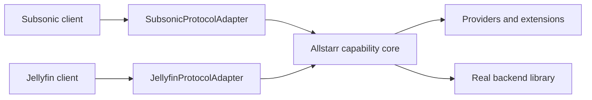

# Protocol References

Use this file when changing Jellyfin, Subsonic, OpenSubsonic, scrobbling, or client compatibility behavior. The root plan is [OVERHAUL.md](../../../OVERHAUL.md).

## Jellyfin

Local source:

- [apis/specifications/jellyfin/openapi-12.0.0.json](../../../apis/specifications/jellyfin/openapi-12.0.0.json)

External source:

- [Jellyfin OpenAPI index](https://fra1.mirror.jellyfin.org/files/files/openapi/)
- [Jellyfin stable OpenAPI JSON](https://fra1.mirror.jellyfin.org/files/files/openapi/jellyfin-openapi-stable.json)
- [Jellyfin plugins docs](https://jellyfin.org/docs/general/server/plugins/)

Relevant local controller files:

- [allstarr/Controllers/JellyfinController.Audio.cs](../../../allstarr/Controllers/JellyfinController.Audio.cs)
- [allstarr/Controllers/JellyfinController.Search.cs](../../../allstarr/Controllers/JellyfinController.Search.cs)
- [allstarr/Controllers/JellyfinController.PlaylistHandler.cs](../../../allstarr/Controllers/JellyfinController.PlaylistHandler.cs)
- [allstarr/Controllers/JellyfinController.Spotify.cs](../../../allstarr/Controllers/JellyfinController.Spotify.cs)

The local OpenAPI file includes InstantMix endpoints for:

- `/Albums/{itemId}/InstantMix`
- `/Artists/{itemId}/InstantMix`
- `/Items/{itemId}/InstantMix`
- `/MusicGenres/{name}/InstantMix`
- `/Playlists/{itemId}/InstantMix`
- `/Songs/{itemId}/InstantMix`

Use Jellyfin InstantMix as one selectable recommendation engine. Do not assume Allstarr must generate every queue itself.

Current Jellyfin controller actions have a narrow backend-authentication boundary. `Users/AuthenticateByName`,
`System/Info/Public`, and the static `/web` login assets remain public. Before every other controller action,
`JellyfinAuthFilter` calls backend `Users/Me` with only the client's authentication headers and any `api_key` or
`access_token` query credential. A failed verification preserves the upstream status and JSON error without running
the action, reading its cache, or calling a provider. The filter records the stable backend principal ID in request
state, but it does not replace `BackendIdentityResolver` or select a provider account.

### Protocol Fixture Sources

- [protocol-source-lock.json](../../../allstarr.Tests/Fixtures/Protocols/protocol-source-lock.json) is the
  machine-checked source lock for the local Jellyfin OpenAPI version/content hash and the local octo-fiesta
  and Last.fm reference revisions. Update that lock deliberately when a source changes.
- [protocol-support-matrix.json](../../../allstarr.Tests/Fixtures/Protocols/protocol-support-matrix.json)
  is the endpoint-level current/target inventory. Every named fixture must be a checked-in valid JSON file;
  `ProtocolSupportMatrixTests` enforces that rule, while the accompanying `testLocation` identifies executable coverage.
- `ProtocolRouteFixtureTests` boots the real selected host against fake upstream HTTP. Current Jellyfin
  fixtures cover login status/body preservation and the `Users/Me` auth boundary before search, external
  item, stream, or favorite actions. External item metadata, placeholder images, conditional image responses,
  and local-first lyrics behavior are shaped behind Jellyfin protocol adapters and covered through the real
  host. Favorite status/body behavior, playback capability/progress responses, unresolved-identity side-effect
  suppression, and all six pinned InstantMix route classes now have real-host fixtures too.
  `ProxyResponseResultFactoryTests` covers shared JSON/empty response status preservation. Subsonic
  fixtures cover password, salted-token, and API-key verification before synthesized work; independent `search3`
  windows; local item and conditional cover-art relay; structured lyrics; GET/form POST source fidelity; repeated
  ordered favorite, playlist, and scrobble values; and upstream status, body, content type, and end-to-end headers.
- `protocol-streaming-ranges.json` drives both selected hosts through authenticated local stream relays. It
  covers GET and HEAD, `Range` plus `If-Range`, upstream 206/416 status, content type, range/cache validators,
  and confirms that a backend-produced partial response is not ranged a second time by the protocol host.
  External provider expiry and range leases stay in the typed streaming lane rather than this adapter.

The fixture harness runs in the `Testing` environment, uses temporary state and fake HTTP, skips live
SquidWTF discovery, and does not run the startup-validation orchestrator. Protocol characterization must
not require a real backend or provider account.

## Subsonic And OpenSubsonic

External sources:

- [OpenSubsonic API](https://opensubsonic.netlify.app/docs/opensubsonic-api/)
- [OpenSubsonic getLyricsBySongId](https://opensubsonic.netlify.app/docs/endpoints/getlyricsbysongid/)
- [Subsonic API](https://www.subsonic.org/pages/api.jsp)

Local source:

- [octo-fiesta at the pinned reference revision](https://github.com/V1ck3s/octo-fiesta/tree/a1ec833fc9805db6a5170a1a777a39534dae0eef)

### Current Code And Parity-Gap Migration

Allstarr already has a `SubsonicController`, request parser, response builder, model mapper, and proxy service. Do not describe future work as a wholesale reintegration or replace that surface with a second provider stack. Use octo-fiesta as a behavior and test reference, then port only verified gaps into the shared capability core.

The current explicit adapter routes include `search3`, `stream`, `getSong`, `getAlbum`, `getArtist`, `getCoverArt`, `star`, `unstar`, `updatePlaylist`, `getLyricsBySongId`, and `scrobble`; the catch-all relay carries other backend endpoints. Provider-neutral playlist writes, optional favorite work, and authenticated playback observations now use durable shared-core boundaries.

The Subsonic authentication boundary uses a resource filter before model binding so form credentials remain
available for verification.
It accepts exactly one native mechanism (`u+p`, `u+t+s`, or `apiKey`), verifies it against backend `ping`,
uses `tokenInfo` to resolve the API-key username, preserves backend protocol failures, and stops the action
before provider/cache work on failure. `BackendIdentityResolver` resolves an existing canonical identity when
one is linked, and the post-authentication filter creates the shared `ProtocolExecutionContext`. The generic
relay retains inbound method, exact `.view` path, query/form source, repeated ordered values, raw body, content
type, conditional headers, upstream HTTP status, response body, and end-to-end response headers.

Use octo-fiesta to compare and, where needed, adapt:

- request parsing and response building
- auth and token forwarding behavior
- model mapping and proxy behavior
- `stream`, `search3`, item, image, lyrics, favorite, playlist, and scrobble edge cases
- focused protocol tests

Do not make Subsonic a separate provider stack. It should be a protocol adapter over the same Allstarr core:

## Protocol Parity And Support Matrix

This is the checked-in compatibility inventory. “Current” describes the implemented Allstarr surface; “target”
describes ownership that still belongs in the shared core or a later phase. Keep a row accurate when an endpoint
is added or moved.

| Concern | Jellyfin current surface | Subsonic/OpenSubsonic current surface | Target core requirement |
| --- | --- | --- | --- |
| Authentication and session setup | Transparent `Users/AuthenticateByName` forwarding plus client-authenticated `Users/Me` verification before non-public controller actions; no canonical Allstarr identity mapping yet. | Password, salted-token, or API-key credentials are backend-verified before non-public synthesized actions; a backend username is recorded, but no canonical Allstarr identity mapping exists yet. | Preserve protocol-native authentication and resolve a verified backend principal into an Allstarr actor only when a user-scoped core action is needed. |
| Search and browse | Merged `Items` and `Search/Hints` routes, then normal backend proxy behavior. | `search3` merges local and external results; other browse endpoints are generally relayed. | Normalize search requests/results behind the core without changing pagination, ordering, or protocol response shape. |
| Item metadata and images | Explicit external item and image response shaping. | Explicit `getSong`, `getAlbum`, `getArtist`, and `getCoverArt` handling. | Use stable typed IDs and preserve protocol-specific model/error semantics. |
| Streaming and ranges | Local proxy streams and external download-and-stream routes support client playback behavior. | `stream` relays local files or serves/downloads external tracks. | Route through the streaming lane with cancellation, range, expiry, and provider-failure semantics defined per protocol. |
| Favorites and stars | Local favorite/unfavorite requests proxy to Jellyfin. A resolved canonical actor can emit a durable, idempotent favorite event after the backend succeeds. Optional actions use the saved tenant/user/backend/library policy and expose failures without changing the backend result. Unfavorite preserves source and managed files. | `star` and `unstar` preserve Subsonic response semantics, then use the same durable optional pipeline when the principal is linked and policy allows it. Subsonic refresh credentials are resolved from an encrypted reference at execution time. | Keep every extra action opt-in. Never let route IDs select another user, and never make unstar delete a source or shared managed file. |
| Playlists | External compatibility responses remain, while provider-neutral virtual/hybrid IDs read accepted or pinned local matches from tenant-scoped snapshots without touching the backend playlist. | `search3` can expose external playlists; `getPlaylist[.view]` reads provider-neutral virtual/hybrid links as XML or JSON, while native IDs remain transparent relay requests. | Continue using `PlaylistVirtualizationService` for account-scoped snapshots and matching, plus virtual reads or idempotent manual/scheduled materialization into the selected Jellyfin or Subsonic-compatible backend. |
| Lyrics and scrobbling | Lyrics orchestration and playback hooks are explicit. Optional durable signals and scrobbles require a resolved canonical actor; normal playback reporting stays transparent for verified unlinked principals. | Structured lyrics and explicit scrobble handling preserve XML or JSON and GET or POST behavior. Linked actors can enter the same durable observation path; native relay behavior remains intact where no optional action applies. | Keep delivery idempotent, account-scoped, and independent of the native response. Feed intelligence only when the exact scope is opted in. |
| Response compatibility | Jellyfin JSON/HTTP route shapes are explicitly handled before catch-all proxying. | Explicit routes support XML or JSON, and both GET and POST. | Translate at the adapter boundary only; preserve status codes, response format, repeated parameters, and pagination fields. |

Before marking a row complete, test it with a client-compatible fixture for both supported protocols where the core capability is shared. A backend's unsupported operation is not an excuse to silently substitute a different mutation.

The Jellyfin catch-all uses a raw protocol relay for allowed unhandled routes. It keeps the incoming method, raw query/body, client authentication, end-to-end headers, upstream status, content type, and response bytes for GET, POST, PUT, PATCH, DELETE, and HEAD. Hop-by-hop headers are removed at each HTTP connection boundary. Routes that Allstarr explicitly blocks remain blocked rather than being made transparent by the generic relay.

### Backend Playlist Materialization

Playlist source and playlist target are separate choices. Spotify, Apple MusicKit, or another playlist provider supplies the immutable source snapshot. The selected backend adapter writes a real playlist to Jellyfin or to a Subsonic/OpenSubsonic-compatible server such as Navidrome.

The shared playlist service owns matching, ordering, idempotency, schedules, conflict policy, and the decision to reconcile or recreate. Protocol/backend adapters own only the backend-specific calls and compatibility details:

- Resolve accepted matches to local item IDs in that exact backend instance. Do not write provider pseudo-items or another backend's IDs into a materialized playlist.
- Create or locate the linked target playlist, read its current membership and revision or fingerprint, and apply the ordered plan without adding a track that is already present.
- Support explicit reconcile and recreate operations. Recreate should use staged replacement when the backend permits it; every fallback rebuild flow needs a recoverable, tested failure path.
- Write source name, description, and artwork when that backend exposes a compatible operation. Report unsupported metadata fields instead of claiming a successful sync.
- Preserve protocol-native status, authorization, paging, repeated-value, and error behavior. A backend write failure is a durable job failure, not a reason to mutate the source-provider playlist or switch target backends.
- Keep virtual mode separate. `allstarr-vpl-{playlistLinkGuidN}` reads require the linked tenant owner plus the exact library, protocol, and backend instance. They preserve immutable source order and expose accepted or manually pinned local backend IDs only. The current provider-neutral path does not enable external stream fallback and never creates or changes a backend playlist.

Maintain a materialization capability row for each supported backend version. It should state membership write support, ordering behavior, playlist metadata/artwork support, revision/conflict mechanism, staged replacement availability, fixture source, and regression-test location. Navidrome compatibility must be verified through the Subsonic/OpenSubsonic adapter and fixtures, not assumed from the protocol label alone.

## Protocol Request And Account Context

Transparent proxy authentication remains intact. The shared request context is implemented after each protocol's authentication filter; it is not a second client login system:

- `ProtocolExecutionContextFilter` creates an immutable `ProtocolExecutionContext` containing protocol, backend instance, verified backend principal ID, canonical Allstarr actor ID when resolved, client/device data, requested library scope, correlation ID, and cancellation/deadline. Protocol adapters consume it, and the router projects its authorized subset into the provider-facing `ProviderExecutionContext`.
- `BackendIdentityResolver` maps a verified `(backend instance, backend principal ID)` to an Allstarr user. Do not authorize a user-scoped action from a route/query `userId`, a display name, or an opaque client token value alone.
- If identity cannot be resolved, retain transparent backend proxy behavior but do not select a user-owned provider account or start a favorite, placement, or playlist side effect.
- Provider-account selection happens after identity resolution and policy evaluation. Pass the selected `ProviderAccount` explicitly to provider calls, including playlist-track retrieval; never infer it from a global default inside a provider implementation.
- Global, per-user, and per-library accounts must be distinguishable in the context, audit event, job record, and WebUI. A fallback may occur only when policy explicitly permits that scope; never fall back to another user's account.
- Context and audit records may contain stable IDs and a correlation ID, never raw auth headers, access tokens, cookies, or provider secrets.

## Scrobbling

Local sources:

- [Jellyfin Last.fm plugin at the pinned reference revision](https://github.com/danielfariati/jellyfin-plugin-lastfm/tree/8e060337953b52d2683aab4dc8c9c6fb7383ddf7)
- [docs/steering/SCROBBLING.md](../SCROBBLING.md)
- [allstarr/Services/Scrobbling](../../../allstarr/Services/Scrobbling)
- [allstarr/Controllers/ScrobblingAdminController.cs](../../../allstarr/Controllers/ScrobblingAdminController.cs)

Required behavior:

- Last.fm test endpoint returns a useful UI error when Last.fm returns 403 or another failure.
- ListenBrainz test endpoint returns a useful UI error.
- Session keys and user tokens are stored as masked secrets.
- No hard-coded Last.fm session key should be required.
- Authenticated observations cross the durable playback job boundary. Allowed signals feed the exact opted-in intelligence scope; disabled or purged scopes do not retain recommendation history.

## Protocol Adapter Rules

- Protocol adapters translate request and response shapes only.
- Provider decisions belong in `ProviderRouter`.
- Matching decisions belong in `TrackIdentityService`.
- Playlist rewrites belong in `PlaylistVirtualizationService`.
- Backend playlist writes belong in capability-checked Jellyfin and Subsonic/OpenSubsonic target adapters. Source provider logic must not write backend playlists directly.
- Downloads and favorites run through `FavoriteActionPipeline`, provider download artifact records, and `FilePlacementService`.
- A non-idempotent file, playlist, or provider mutation must be represented by a durable event/job; do not create it with an untracked fire-and-forget task in an adapter.
- Preserve the backend's favorite/star result before running optional Allstarr actions. An optional action failure must not rewrite a successful protocol response into an unrelated failure.
- Jellyfin library refresh uses the configured API key. Subsonic/Navidrome refresh uses a tenant-scoped encrypted credential reference; neither credential belongs in a durable payload or response.
- Keep client compatibility tests near protocol adapters. Cover Jellyfin response/error shapes and Subsonic GET/POST plus XML/JSON behavior, then add core parity tests for shared capabilities.
- Test playlist reconcile and recreate against both backend families, including order, existing-item reuse, skipped unmatched tracks, description/artwork support, target conflicts, interruption, and duplicate-safe retry.
